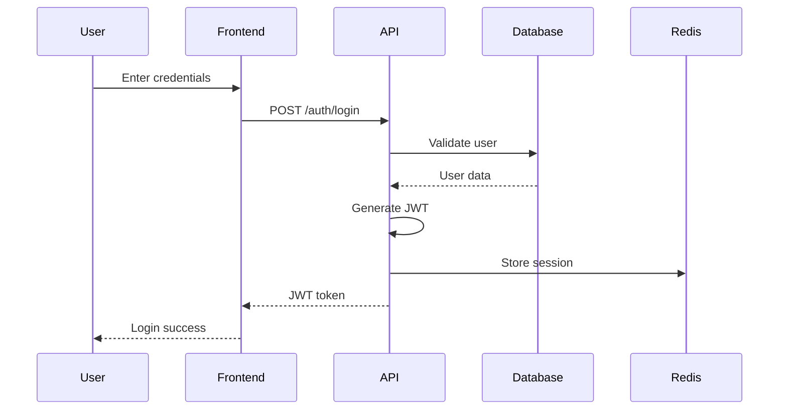
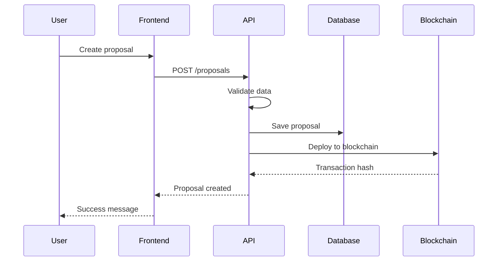
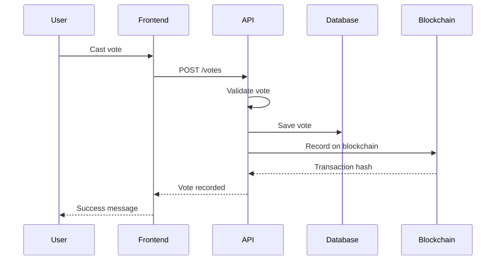
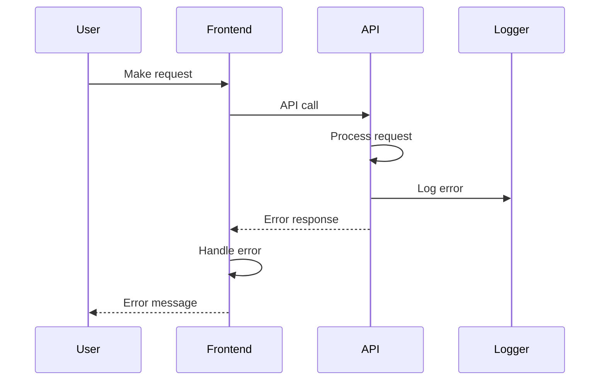

# API Flow Diagram

## Authentication Flow

```mermaid
sequenceDiagram
    participant U as User
    participant F as Frontend
    participant A as API
    participant D as Database
    participant R as Redis

    U->>F: Enter credentials
    F->>A: POST /auth/login
    A->>D: Validate user
    D-->>A: User data
    A->>A: Generate JWT
    A->>R: Store session
    A-->>F: JWT token
    F-->>U: Login success
```

## Proposal Creation Flow

```mermaid
sequenceDiagram
    participant U as User
    participant F as Frontend
    participant A as API
    participant D as Database
    participant B as Blockchain

    U->>F: Create proposal
    F->>A: POST /proposals
    A->>A: Validate data
    A->>D: Save proposal
    A->>B: Deploy to blockchain
    B-->>A: Transaction hash
    A-->>F: Proposal created
    F-->>U: Success message
```

## Voting Flow

```mermaid
sequenceDiagram
    participant U as User
    participant F as Frontend
    participant A as API
    participant D as Database
    participant B as Blockchain

    U->>F: Cast vote
    F->>A: POST /votes
    A->>A: Validate vote
    A->>D: Save vote
    A->>B: Record on blockchain
    B-->>A: Transaction hash
    A-->>F: Vote recorded
    F-->>U: Success message
```

## Error Handling Flow

```mermaid
sequenceDiagram
    participant U as User
    participant F as Frontend
    participant A as API
    participant L as Logger

    U->>F: Make request
    F->>A: API call
    A->>A: Process request
    A->>L: Log error
    A-->>F: Error response
    F->>F: Handle error
    F-->>U: Error message
```
