# API Flow Diagrams

## Overview

This document provides comprehensive API flow diagrams for the REChain DAO platform, including authentication flows, governance processes, wallet operations, and transaction handling.

## Table of Contents

1. [Authentication Flows](#authentication-flows)
2. [User Management Flows](#user-management-flows)
3. [Governance Flows](#governance-flows)
4. [Wallet Operations](#wallet-operations)
5. [Transaction Flows](#transaction-flows)
6. [Notification Flows](#notification-flows)
7. [Error Handling Flows](#error-handling-flows)

## Authentication Flows

### User Registration Flow
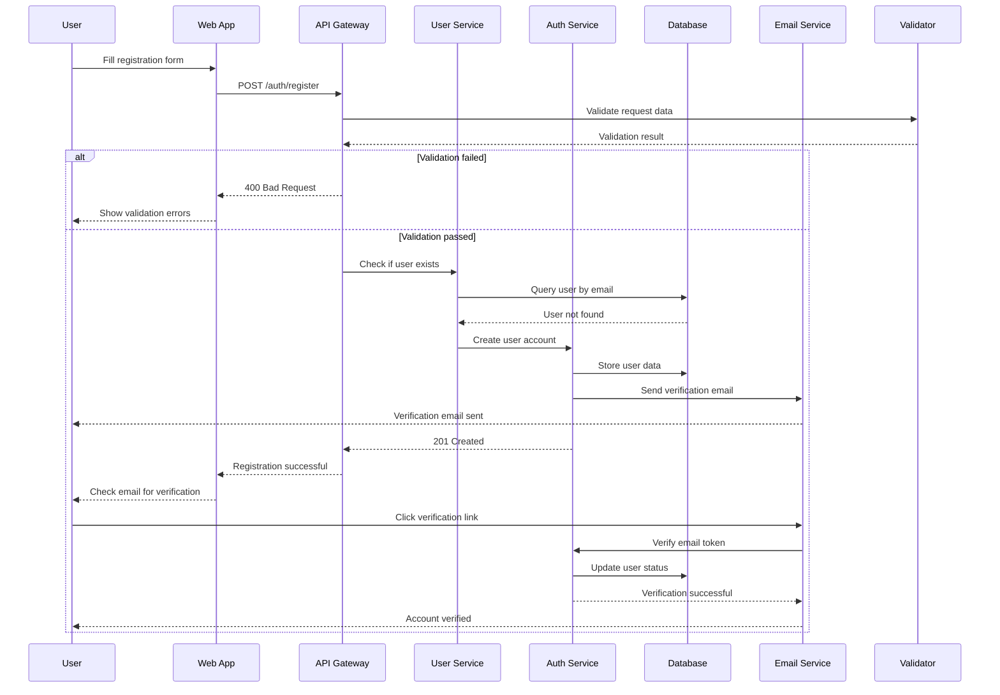
```mermaid
sequenceDiagram
    participant U as User
    participant W as Web App
    participant A as API Gateway
    participant US as User Service
    participant AS as Auth Service
    participant DB as Database
    participant E as Email Service
    participant V as Validator
    
    U->>W: Fill registration form
    W->>A: POST /auth/register
    A->>V: Validate request data
    V-->>A: Validation result
    
    alt Validation failed
        A-->>W: 400 Bad Request
        W-->>U: Show validation errors
    else Validation passed
        A->>US: Check if user exists
        US->>DB: Query user by email
        DB-->>US: User not found
        
        US->>AS: Create user account
        AS->>DB: Store user data
        AS->>E: Send verification email
        E-->>U: Verification email sent
        
        AS-->>A: 201 Created
        A-->>W: Registration successful
        W-->>U: Check email for verification
        
        U->>E: Click verification link
        E->>AS: Verify email token
        AS->>DB: Update user status
        AS-->>E: Verification successful
        E-->>U: Account verified
    end
```

### User Login Flow
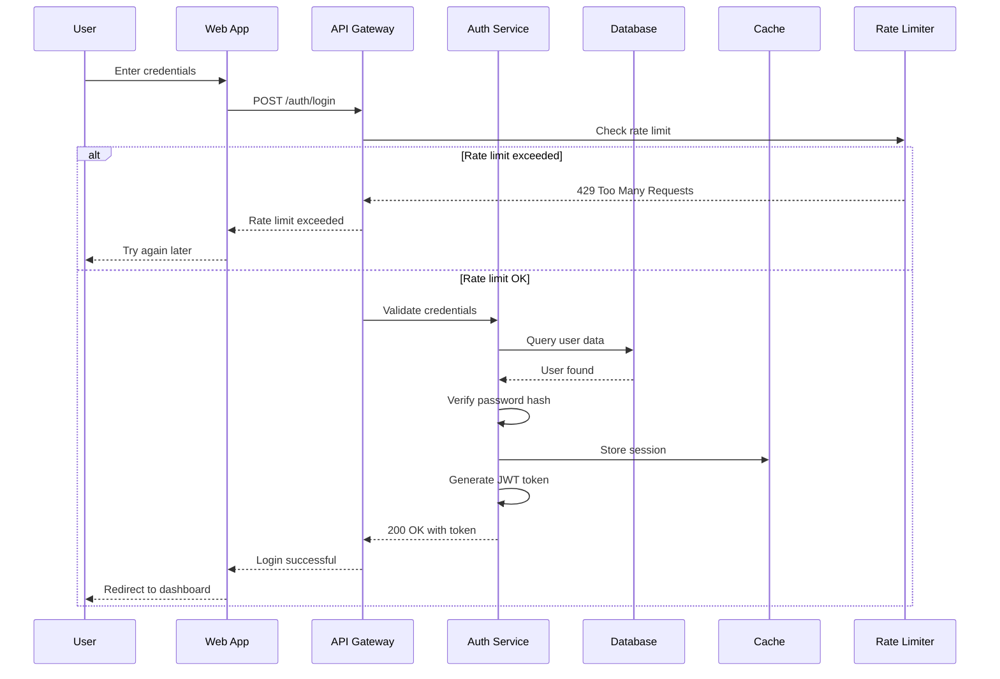
```mermaid
sequenceDiagram
    participant U as User
    participant W as Web App
    participant A as API Gateway
    participant AS as Auth Service
    participant DB as Database
    participant C as Cache
    participant R as Rate Limiter
    
    U->>W: Enter credentials
    W->>A: POST /auth/login
    A->>R: Check rate limit
    
    alt Rate limit exceeded
        R-->>A: 429 Too Many Requests
        A-->>W: Rate limit exceeded
        W-->>U: Try again later
    else Rate limit OK
        A->>AS: Validate credentials
        AS->>DB: Query user data
        DB-->>AS: User found
        
        AS->>AS: Verify password hash
        AS->>C: Store session
        AS->>AS: Generate JWT token
        
        AS-->>A: 200 OK with token
        A-->>W: Login successful
        W-->>U: Redirect to dashboard
    end
```

### OAuth Flow
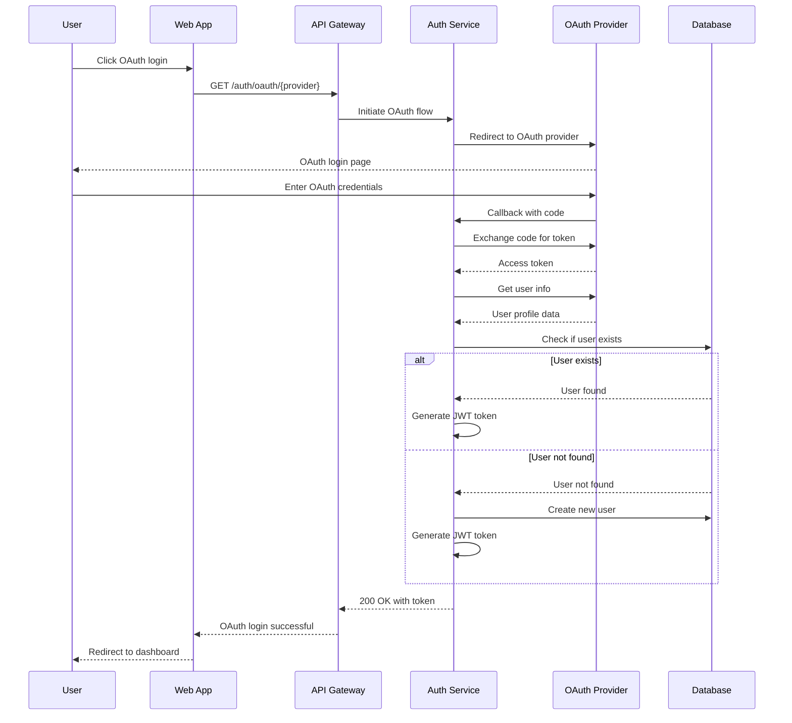
```mermaid
sequenceDiagram
    participant U as User
    participant W as Web App
    participant A as API Gateway
    participant AS as Auth Service
    participant O as OAuth Provider
    participant DB as Database
    
    U->>W: Click OAuth login
    W->>A: GET /auth/oauth/{provider}
    A->>AS: Initiate OAuth flow
    AS->>O: Redirect to OAuth provider
    O-->>U: OAuth login page
    
    U->>O: Enter OAuth credentials
    O->>AS: Callback with code
    AS->>O: Exchange code for token
    O-->>AS: Access token
    
    AS->>O: Get user info
    O-->>AS: User profile data
    AS->>DB: Check if user exists
    
    alt User exists
        DB-->>AS: User found
        AS->>AS: Generate JWT token
    else User not found
        DB-->>AS: User not found
        AS->>DB: Create new user
        AS->>AS: Generate JWT token
    end
    
    AS-->>A: 200 OK with token
    A-->>W: OAuth login successful
    W-->>U: Redirect to dashboard
```

## User Management Flows

### Profile Update Flow
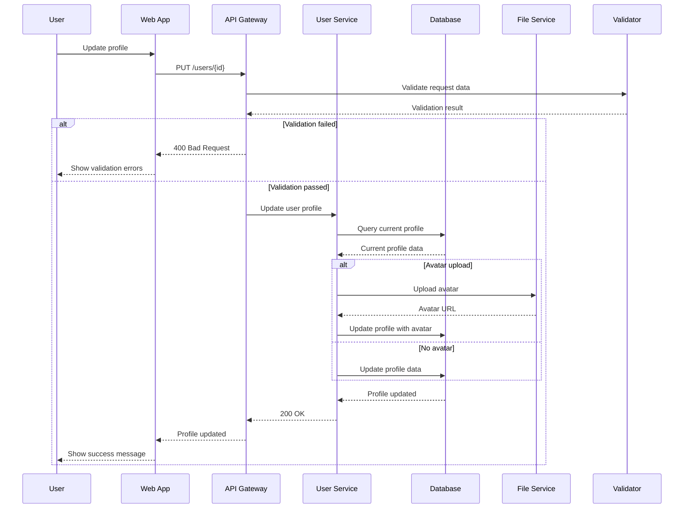
```mermaid
sequenceDiagram
    participant U as User
    participant W as Web App
    participant A as API Gateway
    participant US as User Service
    participant DB as Database
    participant F as File Service
    participant V as Validator
    
    U->>W: Update profile
    W->>A: PUT /users/{id}
    A->>V: Validate request data
    V-->>A: Validation result
    
    alt Validation failed
        A-->>W: 400 Bad Request
        W-->>U: Show validation errors
    else Validation passed
        A->>US: Update user profile
        US->>DB: Query current profile
        DB-->>US: Current profile data
        
        alt Avatar upload
            US->>F: Upload avatar
            F-->>US: Avatar URL
            US->>DB: Update profile with avatar
        else No avatar
            US->>DB: Update profile data
        end
        
        DB-->>US: Profile updated
        US-->>A: 200 OK
        A-->>W: Profile updated
        W-->>U: Show success message
    end
```

### Password Change Flow
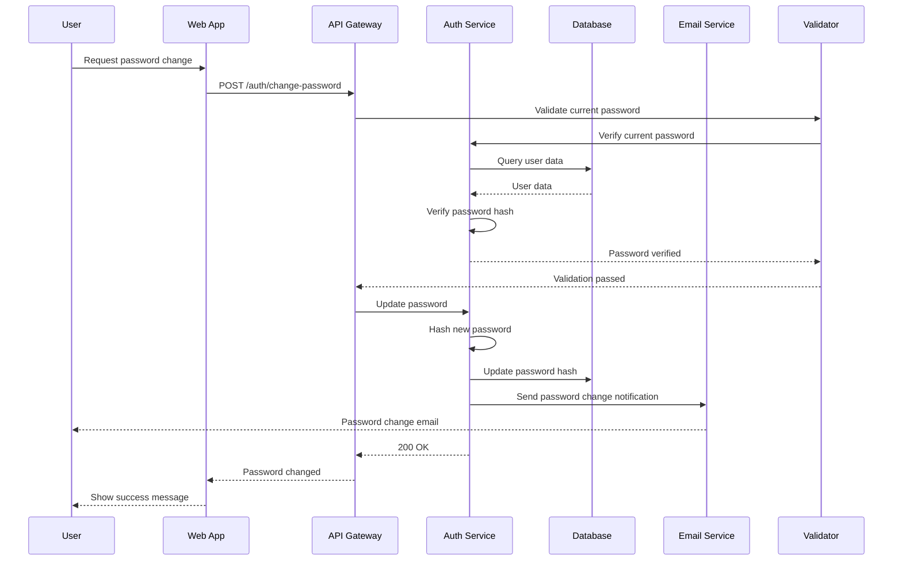
```mermaid
sequenceDiagram
    participant U as User
    participant W as Web App
    participant A as API Gateway
    participant AS as Auth Service
    participant DB as Database
    participant E as Email Service
    participant V as Validator
    
    U->>W: Request password change
    W->>A: POST /auth/change-password
    A->>V: Validate current password
    V->>AS: Verify current password
    AS->>DB: Query user data
    DB-->>AS: User data
    AS->>AS: Verify password hash
    AS-->>V: Password verified
    V-->>A: Validation passed
    
    A->>AS: Update password
    AS->>AS: Hash new password
    AS->>DB: Update password hash
    AS->>E: Send password change notification
    E-->>U: Password change email
    
    AS-->>A: 200 OK
    A-->>W: Password changed
    W-->>U: Show success message
```

## Governance Flows

### Proposal Creation Flow
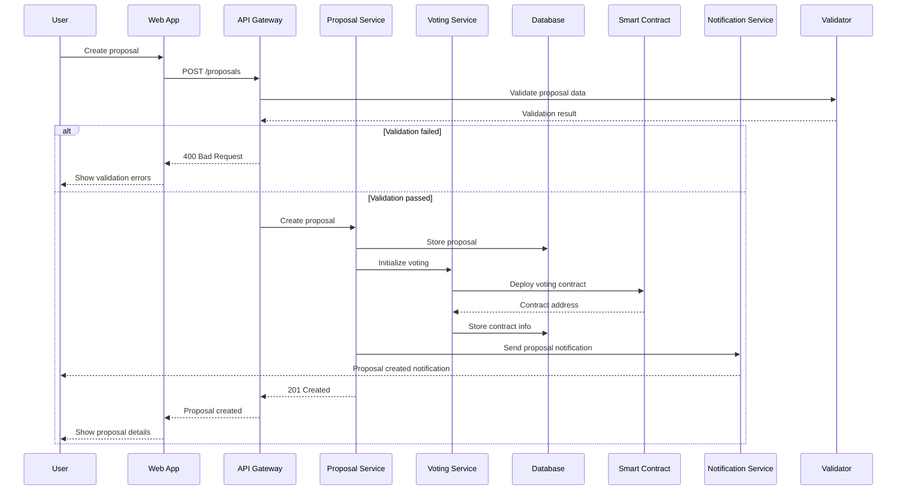
```mermaid
sequenceDiagram
    participant U as User
    participant W as Web App
    participant A as API Gateway
    participant PS as Proposal Service
    participant VS as Voting Service
    participant DB as Database
    participant SC as Smart Contract
    participant N as Notification Service
    participant V as Validator
    
    U->>W: Create proposal
    W->>A: POST /proposals
    A->>V: Validate proposal data
    V-->>A: Validation result
    
    alt Validation failed
        A-->>W: 400 Bad Request
        W-->>U: Show validation errors
    else Validation passed
        A->>PS: Create proposal
        PS->>DB: Store proposal
        PS->>VS: Initialize voting
        VS->>SC: Deploy voting contract
        SC-->>VS: Contract address
        VS->>DB: Store contract info
        
        PS->>N: Send proposal notification
        N-->>U: Proposal created notification
        
        PS-->>A: 201 Created
        A-->>W: Proposal created
        W-->>U: Show proposal details
    end
```

### Voting Flow
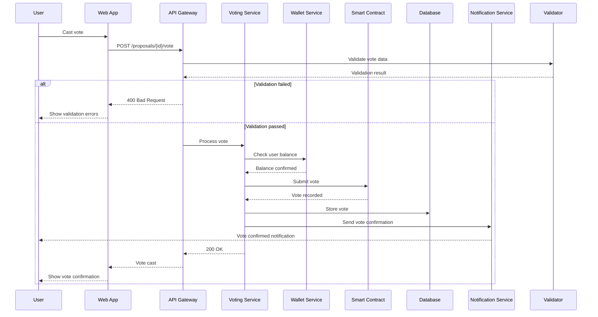
```mermaid
sequenceDiagram
    participant U as User
    participant W as Web App
    participant A as API Gateway
    participant VS as Voting Service
    participant WS as Wallet Service
    participant SC as Smart Contract
    participant DB as Database
    participant N as Notification Service
    participant V as Validator
    
    U->>W: Cast vote
    W->>A: POST /proposals/{id}/vote
    A->>V: Validate vote data
    V-->>A: Validation result
    
    alt Validation failed
        A-->>W: 400 Bad Request
        W-->>U: Show validation errors
    else Validation passed
        A->>VS: Process vote
        VS->>WS: Check user balance
        WS-->>VS: Balance confirmed
        
        VS->>SC: Submit vote
        SC-->>VS: Vote recorded
        VS->>DB: Store vote
        
        VS->>N: Send vote confirmation
        N-->>U: Vote confirmed notification
        
        VS-->>A: 200 OK
        A-->>W: Vote cast
        W-->>U: Show vote confirmation
    end
```

### Proposal Execution Flow
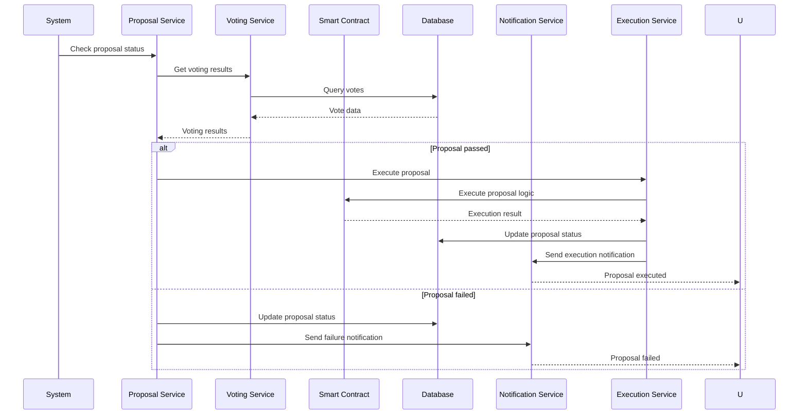
```mermaid
sequenceDiagram
    participant S as System
    participant PS as Proposal Service
    participant VS as Voting Service
    participant SC as Smart Contract
    participant DB as Database
    participant N as Notification Service
    participant E as Execution Service
    
    S->>PS: Check proposal status
    PS->>VS: Get voting results
    VS->>DB: Query votes
    DB-->>VS: Vote data
    VS-->>PS: Voting results
    
    alt Proposal passed
        PS->>E: Execute proposal
        E->>SC: Execute proposal logic
        SC-->>E: Execution result
        E->>DB: Update proposal status
        E->>N: Send execution notification
        N-->>U: Proposal executed
    else Proposal failed
        PS->>DB: Update proposal status
        PS->>N: Send failure notification
        N-->>U: Proposal failed
    end
```

## Wallet Operations

### Wallet Creation Flow
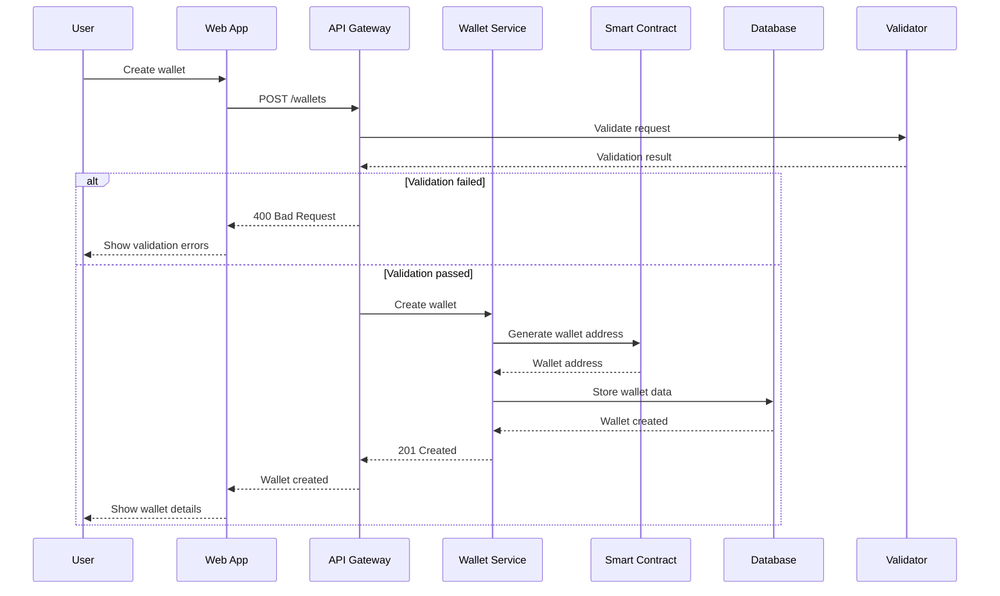
```mermaid
sequenceDiagram
    participant U as User
    participant W as Web App
    participant A as API Gateway
    participant WS as Wallet Service
    participant SC as Smart Contract
    participant DB as Database
    participant V as Validator
    
    U->>W: Create wallet
    W->>A: POST /wallets
    A->>V: Validate request
    V-->>A: Validation result
    
    alt Validation failed
        A-->>W: 400 Bad Request
        W-->>U: Show validation errors
    else Validation passed
        A->>WS: Create wallet
        WS->>SC: Generate wallet address
        SC-->>WS: Wallet address
        WS->>DB: Store wallet data
        DB-->>WS: Wallet created
        
        WS-->>A: 201 Created
        A-->>W: Wallet created
        W-->>U: Show wallet details
    end
```

### Token Transfer Flow
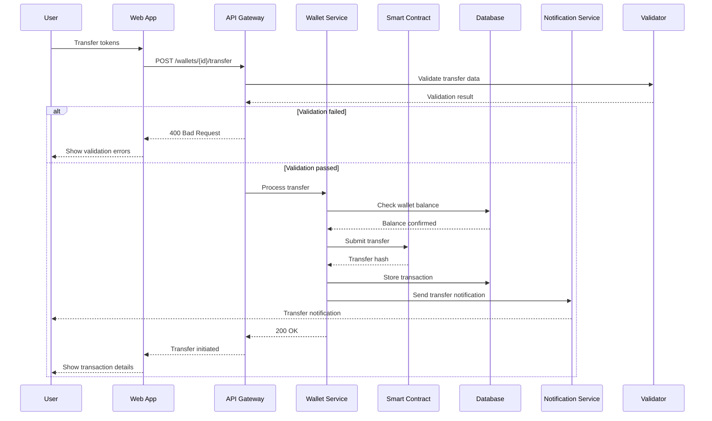
```mermaid
sequenceDiagram
    participant U as User
    participant W as Web App
    participant A as API Gateway
    participant WS as Wallet Service
    participant SC as Smart Contract
    participant DB as Database
    participant N as Notification Service
    participant V as Validator
    
    U->>W: Transfer tokens
    W->>A: POST /wallets/{id}/transfer
    A->>V: Validate transfer data
    V-->>A: Validation result
    
    alt Validation failed
        A-->>W: 400 Bad Request
        W-->>U: Show validation errors
    else Validation passed
        A->>WS: Process transfer
        WS->>DB: Check wallet balance
        DB-->>WS: Balance confirmed
        
        WS->>SC: Submit transfer
        SC-->>WS: Transfer hash
        WS->>DB: Store transaction
        WS->>N: Send transfer notification
        N-->>U: Transfer notification
        
        WS-->>A: 200 OK
        A-->>W: Transfer initiated
        W-->>U: Show transaction details
    end
```

### Balance Query Flow
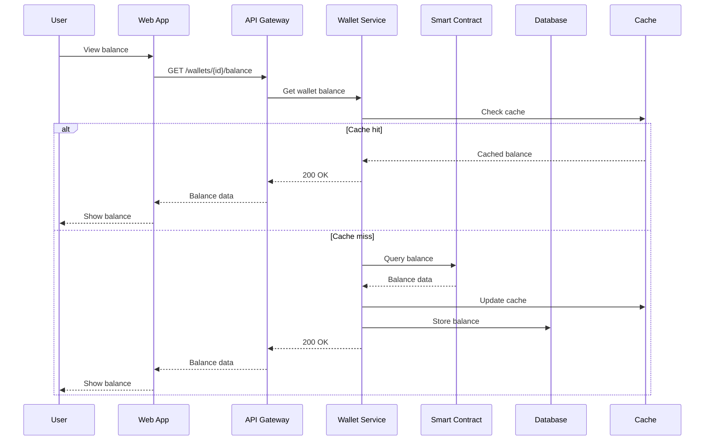
```mermaid
sequenceDiagram
    participant U as User
    participant W as Web App
    participant A as API Gateway
    participant WS as Wallet Service
    participant SC as Smart Contract
    participant DB as Database
    participant C as Cache
    
    U->>W: View balance
    W->>A: GET /wallets/{id}/balance
    A->>WS: Get wallet balance
    WS->>C: Check cache
    
    alt Cache hit
        C-->>WS: Cached balance
        WS-->>A: 200 OK
        A-->>W: Balance data
        W-->>U: Show balance
    else Cache miss
        WS->>SC: Query balance
        SC-->>WS: Balance data
        WS->>C: Update cache
        WS->>DB: Store balance
        WS-->>A: 200 OK
        A-->>W: Balance data
        W-->>U: Show balance
    end
```

## Transaction Flows

### Transaction Submission Flow
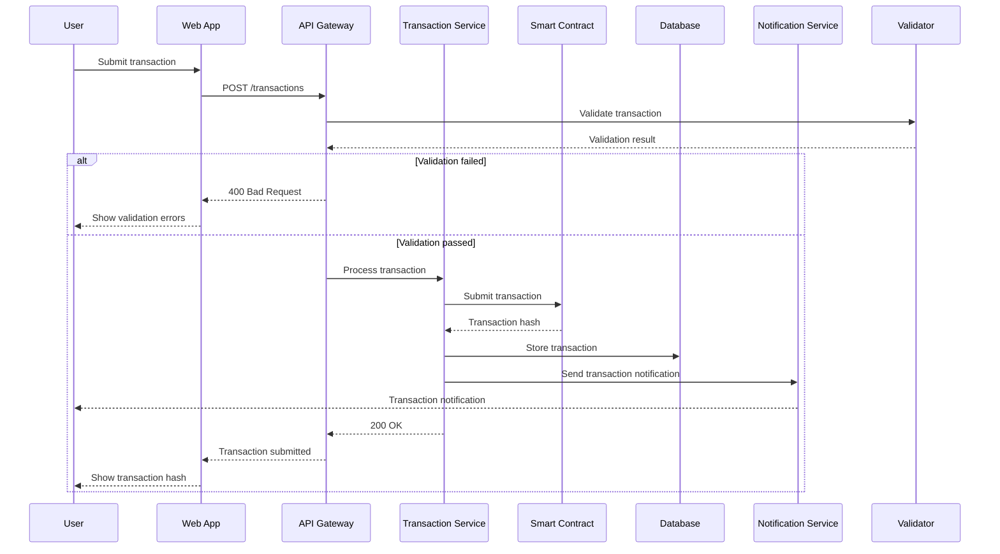
```mermaid
sequenceDiagram
    participant U as User
    participant W as Web App
    participant A as API Gateway
    participant TS as Transaction Service
    participant SC as Smart Contract
    participant DB as Database
    participant N as Notification Service
    participant V as Validator
    
    U->>W: Submit transaction
    W->>A: POST /transactions
    A->>V: Validate transaction
    V-->>A: Validation result
    
    alt Validation failed
        A-->>W: 400 Bad Request
        W-->>U: Show validation errors
    else Validation passed
        A->>TS: Process transaction
        TS->>SC: Submit transaction
        SC-->>TS: Transaction hash
        TS->>DB: Store transaction
        TS->>N: Send transaction notification
        N-->>U: Transaction notification
        
        TS-->>A: 200 OK
        A-->>W: Transaction submitted
        W-->>U: Show transaction hash
    end
```

### Transaction Confirmation Flow
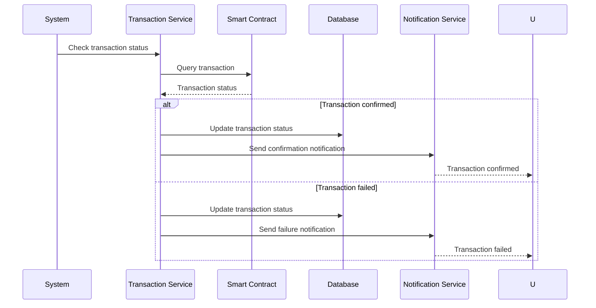
```mermaid
sequenceDiagram
    participant S as System
    participant TS as Transaction Service
    participant SC as Smart Contract
    participant DB as Database
    participant N as Notification Service
    
    S->>TS: Check transaction status
    TS->>SC: Query transaction
    SC-->>TS: Transaction status
    
    alt Transaction confirmed
        TS->>DB: Update transaction status
        TS->>N: Send confirmation notification
        N-->>U: Transaction confirmed
    else Transaction failed
        TS->>DB: Update transaction status
        TS->>N: Send failure notification
        N-->>U: Transaction failed
    end
```

## Notification Flows

### Notification Creation Flow
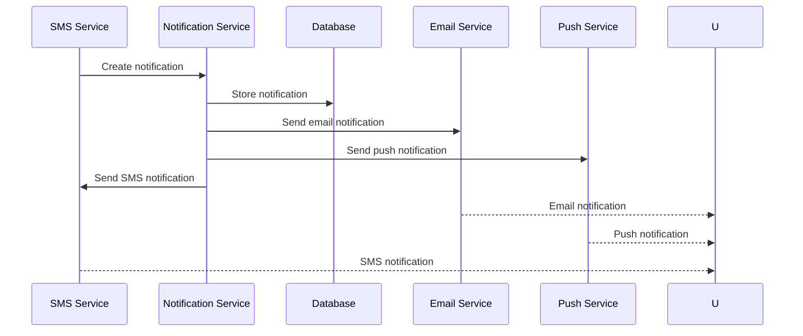
```mermaid
sequenceDiagram
    participant S as System
    participant NS as Notification Service
    participant DB as Database
    participant E as Email Service
    participant P as Push Service
    participant S as SMS Service
    
    S->>NS: Create notification
    NS->>DB: Store notification
    NS->>E: Send email notification
    NS->>P: Send push notification
    NS->>S: Send SMS notification
    
    E-->>U: Email notification
    P-->>U: Push notification
    S-->>U: SMS notification
```

### Notification Delivery Flow
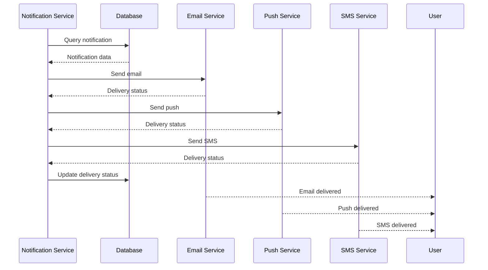
```mermaid
sequenceDiagram
    participant NS as Notification Service
    participant DB as Database
    participant E as Email Service
    participant P as Push Service
    participant S as SMS Service
    participant U as User
    
    NS->>DB: Query notification
    DB-->>NS: Notification data
    
    NS->>E: Send email
    E-->>NS: Delivery status
    NS->>P: Send push
    P-->>NS: Delivery status
    NS->>S: Send SMS
    S-->>NS: Delivery status
    
    NS->>DB: Update delivery status
    E-->>U: Email delivered
    P-->>U: Push delivered
    S-->>U: SMS delivered
```

## Error Handling Flows

### API Error Flow
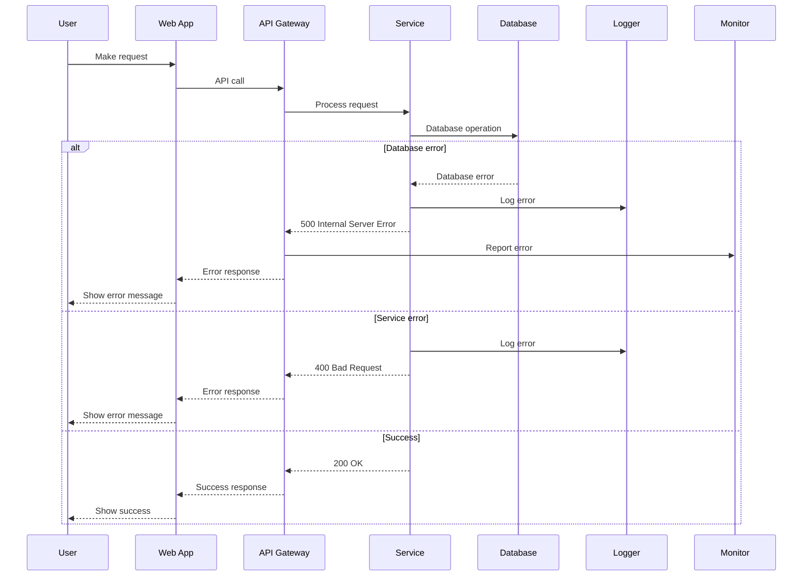
```mermaid
sequenceDiagram
    participant U as User
    participant W as Web App
    participant A as API Gateway
    participant S as Service
    participant DB as Database
    participant L as Logger
    participant M as Monitor
    
    U->>W: Make request
    W->>A: API call
    A->>S: Process request
    S->>DB: Database operation
    
    alt Database error
        DB-->>S: Database error
        S->>L: Log error
        S-->>A: 500 Internal Server Error
        A->>M: Report error
        A-->>W: Error response
        W-->>U: Show error message
    else Service error
        S->>L: Log error
        S-->>A: 400 Bad Request
        A-->>W: Error response
        W-->>U: Show error message
    else Success
        S-->>A: 200 OK
        A-->>W: Success response
        W-->>U: Show success
    end
```

### Rate Limiting Flow
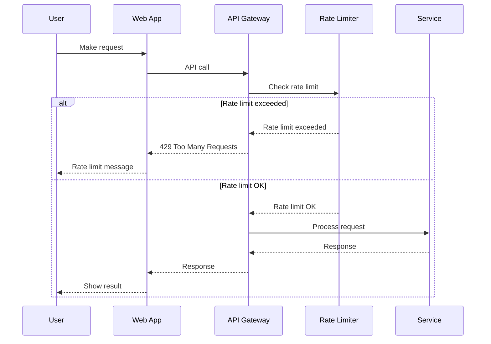
```mermaid
sequenceDiagram
    participant U as User
    participant W as Web App
    participant A as API Gateway
    participant R as Rate Limiter
    participant S as Service
    
    U->>W: Make request
    W->>A: API call
    A->>R: Check rate limit
    
    alt Rate limit exceeded
        R-->>A: Rate limit exceeded
        A-->>W: 429 Too Many Requests
        W-->>U: Rate limit message
    else Rate limit OK
        R-->>A: Rate limit OK
        A->>S: Process request
        S-->>A: Response
        A-->>W: Response
        W-->>U: Show result
    end
```

### Circuit Breaker Flow
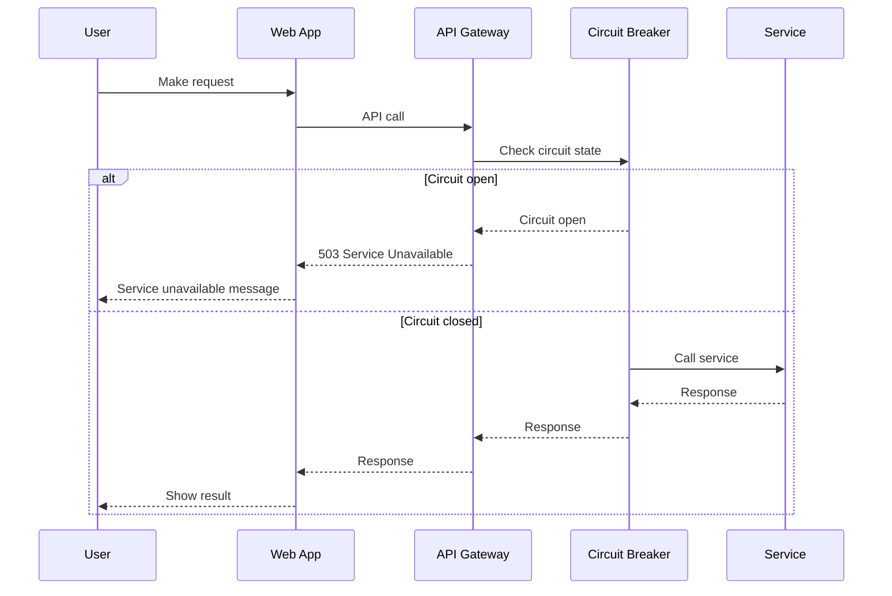
```mermaid
sequenceDiagram
    participant U as User
    participant W as Web App
    participant A as API Gateway
    participant CB as Circuit Breaker
    participant S as Service
    
    U->>W: Make request
    W->>A: API call
    A->>CB: Check circuit state
    
    alt Circuit open
        CB-->>A: Circuit open
        A-->>W: 503 Service Unavailable
        W-->>U: Service unavailable message
    else Circuit closed
        CB->>S: Call service
        S-->>CB: Response
        CB-->>A: Response
        A-->>W: Response
        W-->>U: Show result
    end
```

## Conclusion

These API flow diagrams provide comprehensive visual representations of the REChain DAO platform's API interactions, including authentication, user management, governance, wallet operations, transactions, notifications, and error handling. They serve as essential documentation for developers, testers, and stakeholders to understand the API's behavior and data flow.

Remember: API flows should be regularly updated to reflect changes in the system. They are living documents that evolve with the platform and should be maintained alongside the codebase.
