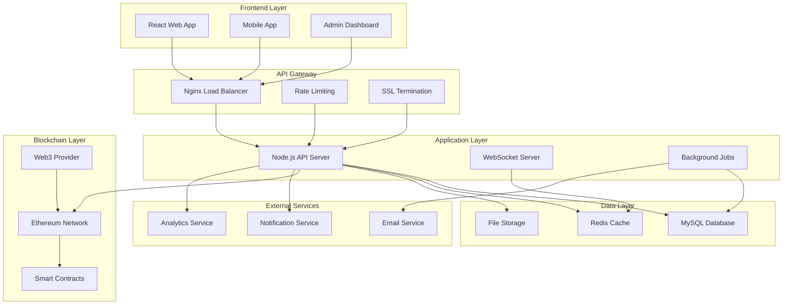
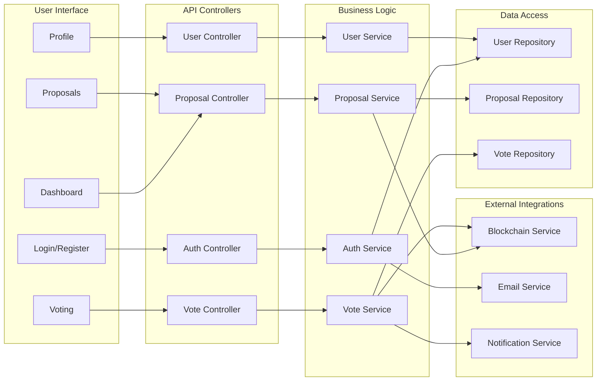
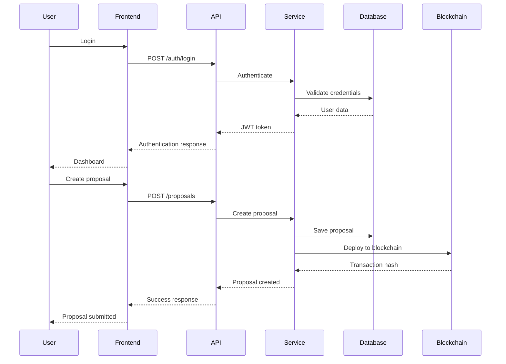
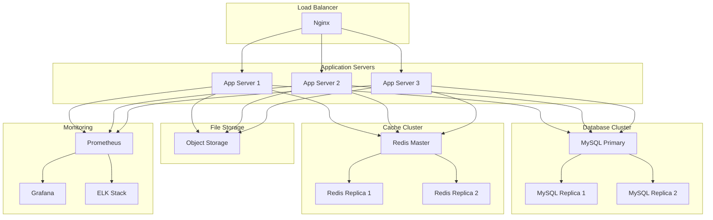
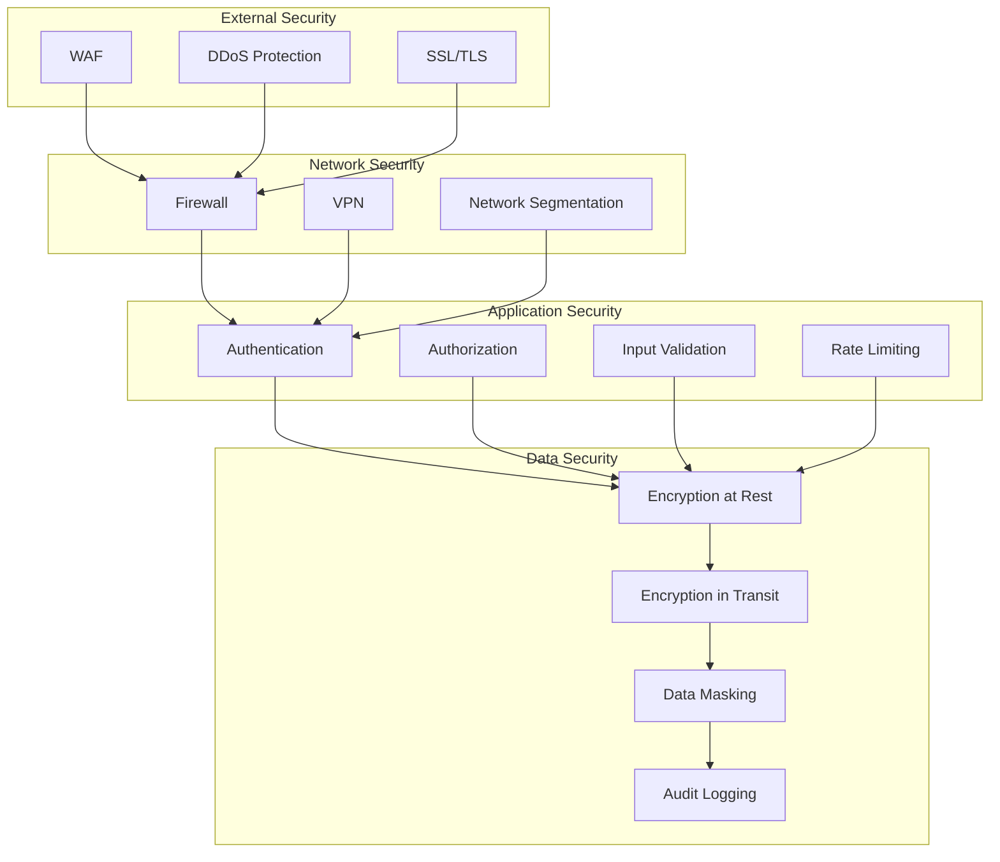

# Architecture Overview

## System Architecture

## Component Architecture

## Data Flow

## Deployment Architecture

## Security Architecture

## Technology Stack

### Frontend
- **React 18** - UI framework
- **TypeScript** - Type safety
- **Tailwind CSS** - Styling
- **React Query** - Data fetching
- **Socket.io** - Real-time updates

### Backend
- **Node.js** - Runtime environment
- **Express.js** - Web framework
- **TypeScript** - Type safety
- **JWT** - Authentication
- **Socket.io** - WebSocket server

### Database
- **MySQL 8.0** - Primary database
- **Redis** - Caching and sessions
- **Knex.js** - Query builder

### Blockchain
- **Ethereum** - Blockchain network
- **Web3.js** - Blockchain interaction
- **Ethers.js** - Ethereum library
- **Smart Contracts** - Solidity

### Infrastructure
- **Docker** - Containerization
- **Kubernetes** - Orchestration
- **Nginx** - Load balancer
- **AWS** - Cloud provider

### Monitoring
- **Prometheus** - Metrics collection
- **Grafana** - Visualization
- **ELK Stack** - Log management
- **Winston** - Logging

## Scalability Considerations

### Horizontal Scaling
- Load balancer distributes traffic
- Multiple application servers
- Database read replicas
- Redis cluster mode

### Vertical Scaling
- Increased server resources
- Database optimization
- Cache optimization
- CDN integration

### Performance Optimization
- Database indexing
- Query optimization
- Caching strategies
- CDN usage
- Image optimization
- Code splitting

## Security Considerations

### Authentication & Authorization
- JWT-based authentication
- Role-based access control
- Multi-factor authentication
- Session management

### Data Protection
- Encryption at rest
- Encryption in transit
- Data masking
- Backup encryption

### Network Security
- SSL/TLS encryption
- Firewall configuration
- VPN access
- Network segmentation

### Application Security
- Input validation
- SQL injection prevention
- XSS protection
- CSRF protection
- Rate limiting
