# Database ER Diagrams

## Overview

This document provides comprehensive Entity-Relationship (ER) diagrams for the REChain DAO platform database, including all entities, relationships, and constraints.

## Table of Contents

1. [Core Entities](#core-entities)
2. [User Management](#user-management)
3. [Governance System](#governance-system)
4. [Wallet System](#wallet-system)
5. [Token Management](#token-management)
6. [Transaction System](#transaction-system)
7. [Notification System](#notification-system)
8. [Audit and Logging](#audit-and-logging)

## Core Entities

### Main ER Diagram


## User Management

### User Entities


## Governance System

### Proposal and Voting Entities


## Wallet System

### Wallet and Transaction Entities

```mermaid
erDiagram
    USER_WALLETS {
        uuid id PK
        uuid user_id FK
        string address
        string network
        string wallet_type
        json metadata
        boolean is_active
        timestamp created_at
        timestamp updated_at
    }
    
    WALLET_TRANSACTIONS {
        uuid id PK
        uuid from_wallet_id FK
        uuid to_wallet_id FK
        uuid token_id FK
        string transaction_hash
        decimal amount
        decimal gas_used
        decimal gas_price
        string status
        integer block_number
        timestamp created_at
        timestamp confirmed_at
    }
    
    WALLET_TOKENS {
        uuid id PK
        uuid wallet_id FK
        uuid token_id FK
        decimal balance
        decimal locked_balance
        timestamp last_updated
    }
    
    WALLET_ADDRESSES {
        uuid id PK
        uuid wallet_id FK
        string address
        string address_type
        boolean is_primary
        timestamp created_at
    }
    
    TRANSACTION_RECEIPTS {
        uuid id PK
        uuid transaction_id FK
        string receipt_hash
        integer gas_used
        string status
        json logs
        timestamp created_at
    }
    
    USER_WALLETS ||--o{ WALLET_TRANSACTIONS : sends
    USER_WALLETS ||--o{ WALLET_TRANSACTIONS : receives
    USER_WALLETS ||--o{ WALLET_TOKENS : holds
    USER_WALLETS ||--o{ WALLET_ADDRESSES : contains
    WALLET_TRANSACTIONS ||--o{ TRANSACTION_RECEIPTS : has
    WALLET_TOKENS }o--|| TOKENS : token_type
```


## Token Management

### Token and Balance Entities


## Transaction System

### Transaction and Block Entities


## Notification System

### Notification and Communication Entities


## Audit and Logging

### Audit and Log Entities


## Database Constraints and Indexes

### Primary Keys and Foreign Keys
```sql
-- Primary Keys
ALTER TABLE users ADD CONSTRAINT pk_users PRIMARY KEY (id);
ALTER TABLE user_profiles ADD CONSTRAINT pk_user_profiles PRIMARY KEY (id);
ALTER TABLE proposals ADD CONSTRAINT pk_proposals PRIMARY KEY (id);
ALTER TABLE proposal_votes ADD CONSTRAINT pk_proposal_votes PRIMARY KEY (id);
ALTER TABLE user_wallets ADD CONSTRAINT pk_user_wallets PRIMARY KEY (id);
ALTER TABLE wallet_transactions ADD CONSTRAINT pk_wallet_transactions PRIMARY KEY (id);
ALTER TABLE tokens ADD CONSTRAINT pk_tokens PRIMARY KEY (id);
ALTER TABLE notifications ADD CONSTRAINT pk_notifications PRIMARY KEY (id);
ALTER TABLE audit_logs ADD CONSTRAINT pk_audit_logs PRIMARY KEY (id);

-- Foreign Keys
ALTER TABLE user_profiles ADD CONSTRAINT fk_user_profiles_user_id 
    FOREIGN KEY (user_id) REFERENCES users(id) ON DELETE CASCADE;

ALTER TABLE proposal_votes ADD CONSTRAINT fk_proposal_votes_proposal_id 
    FOREIGN KEY (proposal_id) REFERENCES proposals(id) ON DELETE CASCADE;

ALTER TABLE proposal_votes ADD CONSTRAINT fk_proposal_votes_user_id 
    FOREIGN KEY (voter_id) REFERENCES users(id) ON DELETE CASCADE;

ALTER TABLE user_wallets ADD CONSTRAINT fk_user_wallets_user_id 
    FOREIGN KEY (user_id) REFERENCES users(id) ON DELETE CASCADE;

ALTER TABLE wallet_transactions ADD CONSTRAINT fk_wallet_transactions_from_wallet 
    FOREIGN KEY (from_wallet_id) REFERENCES user_wallets(id) ON DELETE CASCADE;

ALTER TABLE wallet_transactions ADD CONSTRAINT fk_wallet_transactions_to_wallet 
    FOREIGN KEY (to_wallet_id) REFERENCES user_wallets(id) ON DELETE CASCADE;

ALTER TABLE notifications ADD CONSTRAINT fk_notifications_user_id 
    FOREIGN KEY (user_id) REFERENCES users(id) ON DELETE CASCADE;

ALTER TABLE audit_logs ADD CONSTRAINT fk_audit_logs_user_id 
    FOREIGN KEY (user_id) REFERENCES users(id) ON DELETE SET NULL;
```

### Indexes for Performance
```sql
-- User indexes
CREATE INDEX idx_users_email ON users(email);
CREATE INDEX idx_users_username ON users(username);
CREATE INDEX idx_users_created_at ON users(created_at);
CREATE INDEX idx_users_is_active ON users(is_active);

-- Proposal indexes
CREATE INDEX idx_proposals_status ON proposals(status);
CREATE INDEX idx_proposals_created_at ON proposals(created_at);
CREATE INDEX idx_proposals_voting_start ON proposals(voting_start);
CREATE INDEX idx_proposals_voting_end ON proposals(voting_end);
CREATE INDEX idx_proposals_proposer_id ON proposals(proposer_id);

-- Vote indexes
CREATE INDEX idx_proposal_votes_proposal_id ON proposal_votes(proposal_id);
CREATE INDEX idx_proposal_votes_voter_id ON proposal_votes(voter_id);
CREATE INDEX idx_proposal_votes_created_at ON proposal_votes(created_at);

-- Wallet indexes
CREATE INDEX idx_user_wallets_user_id ON user_wallets(user_id);
CREATE INDEX idx_user_wallets_address ON user_wallets(address);
CREATE INDEX idx_user_wallets_network ON user_wallets(network);

-- Transaction indexes
CREATE INDEX idx_wallet_transactions_from_wallet ON wallet_transactions(from_wallet_id);
CREATE INDEX idx_wallet_transactions_to_wallet ON wallet_transactions(to_wallet_id);
CREATE INDEX idx_wallet_transactions_created_at ON wallet_transactions(created_at);
CREATE INDEX idx_wallet_transactions_status ON wallet_transactions(status);

-- Token indexes
CREATE INDEX idx_tokens_symbol ON tokens(symbol);
CREATE INDEX idx_tokens_contract_address ON tokens(contract_address);
CREATE INDEX idx_tokens_network ON tokens(network);

-- Notification indexes
CREATE INDEX idx_notifications_user_id ON notifications(user_id);
CREATE INDEX idx_notifications_created_at ON notifications(created_at);
CREATE INDEX idx_notifications_is_read ON notifications(is_read);

-- Audit log indexes
CREATE INDEX idx_audit_logs_user_id ON audit_logs(user_id);
CREATE INDEX idx_audit_logs_action ON audit_logs(action);
CREATE INDEX idx_audit_logs_created_at ON audit_logs(created_at);
CREATE INDEX idx_audit_logs_resource_type ON audit_logs(resource_type);
```

## Data Types and Constraints

### Custom Data Types
```sql
-- Enum types
CREATE TYPE user_status AS ENUM ('active', 'inactive', 'banned', 'suspended');
CREATE TYPE proposal_status AS ENUM ('draft', 'active', 'passed', 'rejected', 'expired');
CREATE TYPE vote_type AS ENUM ('for', 'against', 'abstain');
CREATE TYPE transaction_status AS ENUM ('pending', 'confirmed', 'failed', 'cancelled');
CREATE TYPE notification_type AS ENUM ('info', 'warning', 'error', 'success');
CREATE TYPE log_level AS ENUM ('debug', 'info', 'warn', 'error', 'fatal');

-- Custom types
CREATE TYPE address_type AS (
    street VARCHAR(255),
    city VARCHAR(100),
    state VARCHAR(100),
    country VARCHAR(100),
    postal_code VARCHAR(20)
);

CREATE TYPE contact_info AS (
    email VARCHAR(255),
    phone VARCHAR(20),
    website VARCHAR(255)
);
```

### Check Constraints
```sql
-- User constraints
ALTER TABLE users ADD CONSTRAINT chk_users_email_format 
    CHECK (email ~* '^[A-Za-z0-9._%+-]+@[A-Za-z0-9.-]+\.[A-Za-z]{2,}$');

ALTER TABLE users ADD CONSTRAINT chk_users_username_length 
    CHECK (char_length(username) >= 3 AND char_length(username) <= 50);

-- Proposal constraints
ALTER TABLE proposals ADD CONSTRAINT chk_proposals_voting_duration 
    CHECK (voting_end > voting_start);

ALTER TABLE proposals ADD CONSTRAINT chk_proposals_votes_positive 
    CHECK (votes_for >= 0 AND votes_against >= 0);

-- Transaction constraints
ALTER TABLE wallet_transactions ADD CONSTRAINT chk_wallet_transactions_amount_positive 
    CHECK (amount > 0);

ALTER TABLE wallet_transactions ADD CONSTRAINT chk_wallet_transactions_gas_positive 
    CHECK (gas_used >= 0 AND gas_price >= 0);

-- Token constraints
ALTER TABLE tokens ADD CONSTRAINT chk_tokens_decimals_range 
    CHECK (decimals >= 0 AND decimals <= 18);

ALTER TABLE tokens ADD CONSTRAINT chk_tokens_supply_positive 
    CHECK (total_supply >= 0 AND circulating_supply >= 0);
```

## Conclusion

These Entity-Relationship diagrams provide a comprehensive view of the REChain DAO platform's database structure, including all entities, relationships, constraints, and indexes. They serve as essential documentation for database design, development, and maintenance.

Remember: Database schemas should be versioned and migrated carefully. Always test schema changes in development environments before applying them to production databases.
