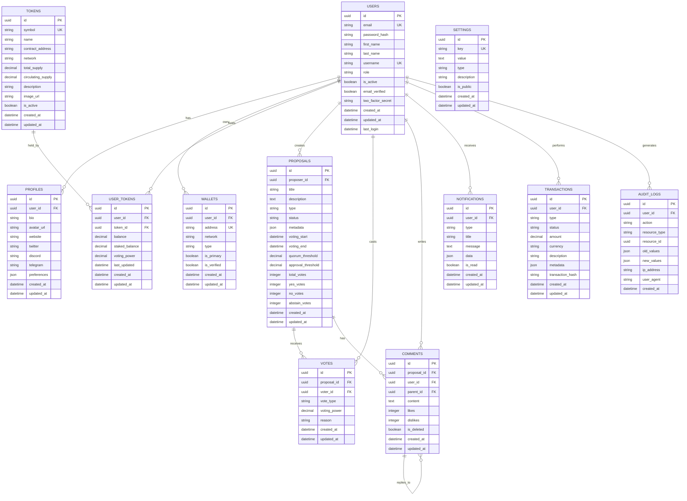

# Database Schema Diagram

## Entity Relationship Diagram

## Table Descriptions

### Core Tables

#### USERS
- **Purpose**: Store user account information
- **Key Fields**: email, password_hash, role, is_active
- **Indexes**: email (unique), username (unique), role

#### PROFILES
- **Purpose**: Store user profile and social information
- **Key Fields**: bio, avatar_url, social links, preferences
- **Indexes**: user_id (foreign key)

#### WALLETS
- **Purpose**: Store user wallet addresses and verification status
- **Key Fields**: address, network, type, is_verified
- **Indexes**: address (unique), user_id (foreign key)

### Token Management

#### TOKENS
- **Purpose**: Store token information and metadata
- **Key Fields**: symbol, name, contract_address, total_supply
- **Indexes**: symbol (unique), contract_address (unique)

#### USER_TOKENS
- **Purpose**: Track user token balances and voting power
- **Key Fields**: balance, staked_balance, voting_power
- **Indexes**: user_id + token_id (composite), voting_power

### Governance

#### PROPOSALS
- **Purpose**: Store governance proposals and their status
- **Key Fields**: title, description, type, status, voting periods
- **Indexes**: proposer_id, status, voting_start, voting_end

#### VOTES
- **Purpose**: Store individual votes on proposals
- **Key Fields**: vote_type, voting_power, reason
- **Indexes**: proposal_id + voter_id (composite), proposal_id

### Social Features

#### COMMENTS
- **Purpose**: Store comments and discussions on proposals
- **Key Fields**: content, likes, dislikes, parent_id
- **Indexes**: proposal_id, user_id, parent_id

#### NOTIFICATIONS
- **Purpose**: Store user notifications
- **Key Fields**: type, title, message, is_read
- **Indexes**: user_id, is_read, created_at

### System

#### TRANSACTIONS
- **Purpose**: Track all financial transactions
- **Key Fields**: type, amount, currency, transaction_hash
- **Indexes**: user_id, type, status, created_at

#### AUDIT_LOGS
- **Purpose**: Track all system changes for auditing
- **Key Fields**: action, resource_type, old_values, new_values
- **Indexes**: user_id, action, created_at

#### SETTINGS
- **Purpose**: Store system configuration settings
- **Key Fields**: key, value, type, is_public
- **Indexes**: key (unique), is_public

## Database Relationships

### One-to-Many Relationships
- Users → Profiles (1:1)
- Users → Wallets (1:many)
- Users → User Tokens (1:many)
- Users → Proposals (1:many)
- Users → Votes (1:many)
- Users → Comments (1:many)
- Users → Notifications (1:many)
- Users → Transactions (1:many)
- Users → Audit Logs (1:many)
- Tokens → User Tokens (1:many)
- Proposals → Votes (1:many)
- Proposals → Comments (1:many)
- Comments → Comments (1:many, self-referencing)

### Many-to-Many Relationships
- Users ↔ Tokens (through USER_TOKENS)
- Users ↔ Proposals (through VOTES)

## Indexing Strategy

### Primary Indexes
- All tables have UUID primary keys
- All foreign keys are indexed
- Unique constraints are indexed

### Composite Indexes
- (user_id, token_id) on USER_TOKENS
- (proposal_id, voter_id) on VOTES
- (proposal_id, created_at) on COMMENTS
- (user_id, is_read) on NOTIFICATIONS

### Performance Indexes
- voting_power on USER_TOKENS
- status on PROPOSALS
- created_at on all tables
- voting_start, voting_end on PROPOSALS

## Data Types

### UUIDs
- Used for all primary and foreign keys
- Provides global uniqueness
- Better performance than auto-incrementing integers

### Decimals
- Used for financial amounts and voting power
- Precision: 18 decimal places
- Scale: 6 decimal places for display

### JSON
- Used for flexible metadata storage
- Allows schema evolution
- Indexed for common query patterns

### Timestamps
- All tables have created_at and updated_at
- Used for auditing and sorting
- Indexed for time-based queries

## Constraints

### Unique Constraints
- email on USERS
- username on USERS
- address on WALLETS
- symbol on TOKENS
- contract_address on TOKENS
- key on SETTINGS

### Check Constraints
- role in USERS (user, moderator, admin)
- vote_type in VOTES (yes, no, abstain)
- status in PROPOSALS (draft, active, passed, rejected, expired)
- type in TRANSACTIONS (deposit, withdrawal, transfer, vote)

### Foreign Key Constraints
- All foreign keys have referential integrity
- Cascade deletes where appropriate
- Restrict deletes for critical relationships

## Partitioning Strategy

### Time-based Partitioning
- AUDIT_LOGS partitioned by month
- NOTIFICATIONS partitioned by month
- TRANSACTIONS partitioned by month

### Hash Partitioning
- VOTES partitioned by proposal_id
- COMMENTS partitioned by proposal_id

## Backup Strategy

### Full Backups
- Daily full backups of all tables
- Compressed and encrypted
- Retained for 30 days

### Incremental Backups
- Hourly incremental backups
- Binary log backups
- Retained for 7 days

### Point-in-Time Recovery
- Binary logs enabled
- 24-hour recovery window
- Tested monthly
