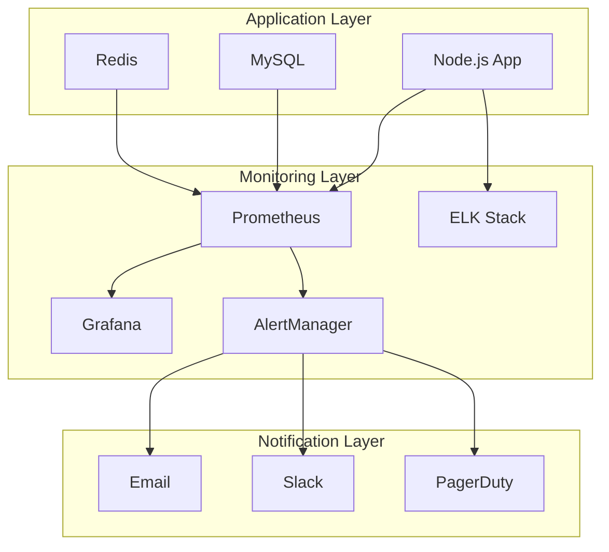

# Monitoring Guide

## Overview

This guide provides comprehensive monitoring strategies for the REChain DAO Platform, including system metrics, application performance, and alerting.

## Table of Contents

1. [Monitoring Stack](#monitoring-stack)
2. [Metrics Collection](#metrics-collection)
3. [Logging Strategy](#logging-strategy)
4. [Alerting Rules](#alerting-rules)
5. [Dashboards](#dashboards)
6. [Troubleshooting](#troubleshooting)

## Monitoring Stack

### Core Components

- **Prometheus**: Metrics collection and storage
- **Grafana**: Visualization and dashboards
- **AlertManager**: Alert routing and notification
- **ELK Stack**: Log aggregation and analysis
- **Jaeger**: Distributed tracing

### Architecture



## Metrics Collection

### Application Metrics

```javascript
// Custom metrics
const prometheus = require('prom-client');

// Create metrics registry
const register = new prometheus.Registry();

// Counter for requests
const httpRequestsTotal = new prometheus.Counter({
  name: 'http_requests_total',
  help: 'Total number of HTTP requests',
  labelNames: ['method', 'route', 'status_code']
});

// Histogram for request duration
const httpRequestDuration = new prometheus.Histogram({
  name: 'http_request_duration_seconds',
  help: 'Duration of HTTP requests in seconds',
  labelNames: ['method', 'route', 'status_code'],
  buckets: [0.1, 0.5, 1, 2, 5, 10]
});

// Gauge for active connections
const activeConnections = new prometheus.Gauge({
  name: 'active_connections',
  help: 'Number of active connections'
});

// Register metrics
register.registerMetric(httpRequestsTotal);
register.registerMetric(httpRequestDuration);
register.registerMetric(activeConnections);
```

### Database Metrics

```javascript
// Database connection metrics
const dbConnections = new prometheus.Gauge({
  name: 'database_connections',
  help: 'Number of database connections',
  labelNames: ['state']
});

// Query duration metrics
const queryDuration = new prometheus.Histogram({
  name: 'database_query_duration_seconds',
  help: 'Duration of database queries in seconds',
  labelNames: ['query_type']
});

// Error metrics
const dbErrors = new prometheus.Counter({
  name: 'database_errors_total',
  help: 'Total number of database errors',
  labelNames: ['error_type']
});
```

### Business Metrics

```javascript
// Proposal metrics
const proposalsTotal = new prometheus.Counter({
  name: 'proposals_total',
  help: 'Total number of proposals',
  labelNames: ['status', 'type']
});

// Vote metrics
const votesTotal = new prometheus.Counter({
  name: 'votes_total',
  help: 'Total number of votes',
  labelNames: ['proposal_id', 'vote_type']
});

// User metrics
const usersTotal = new prometheus.Gauge({
  name: 'users_total',
  help: 'Total number of users',
  labelNames: ['status']
});
```

## Logging Strategy

### Log Levels

```javascript
const winston = require('winston');

const logger = winston.createLogger({
  level: process.env.LOG_LEVEL || 'info',
  format: winston.format.combine(
    winston.format.timestamp(),
    winston.format.errors({ stack: true }),
    winston.format.json()
  ),
  transports: [
    new winston.transports.File({ filename: 'logs/error.log', level: 'error' }),
    new winston.transports.File({ filename: 'logs/combined.log' }),
    new winston.transports.Console({
      format: winston.format.simple()
    })
  ]
});

// Structured logging
logger.info('User action', {
  userId: '123',
  action: 'vote',
  proposalId: '456',
  timestamp: new Date().toISOString()
});
```

### Log Aggregation

```yaml
# docker-compose.monitoring.yml
version: '3.8'

services:
  elasticsearch:
    image: docker.elastic.co/elasticsearch/elasticsearch:7.17.0
    environment:
      - discovery.type=single-node
      - "ES_JAVA_OPTS=-Xms512m -Xmx512m"
    ports:
      - "9200:9200"
    volumes:
      - elasticsearch_data:/usr/share/elasticsearch/data

  logstash:
    image: docker.elastic.co/logstash/logstash:7.17.0
    volumes:
      - ./logstash.conf:/usr/share/logstash/pipeline/logstash.conf
    ports:
      - "5044:5044"
    depends_on:
      - elasticsearch

  kibana:
    image: docker.elastic.co/kibana/kibana:7.17.0
    ports:
      - "5601:5601"
    depends_on:
      - elasticsearch

volumes:
  elasticsearch_data:
```

## Alerting Rules

### Critical Alerts

```yaml
# alerts/critical.yml
groups:
- name: critical
  rules:
  - alert: ServiceDown
    expr: up == 0
    for: 1m
    labels:
      severity: critical
    annotations:
      summary: "Service {{ $labels.instance }} is down"
      description: "Service has been down for more than 1 minute"

  - alert: HighErrorRate
    expr: rate(http_requests_total{status=~"5.."}[5m]) > 0.1
    for: 5m
    labels:
      severity: critical
    annotations:
      summary: "High error rate detected"
      description: "Error rate is {{ $value }} errors per second"

  - alert: DatabaseDown
    expr: mysql_up == 0
    for: 1m
    labels:
      severity: critical
    annotations:
      summary: "Database is down"
      description: "MySQL database is not responding"
```

### Warning Alerts

```yaml
# alerts/warning.yml
groups:
- name: warning
  rules:
  - alert: HighMemoryUsage
    expr: (node_memory_MemTotal_bytes - node_memory_MemAvailable_bytes) / node_memory_MemTotal_bytes > 0.8
    for: 5m
    labels:
      severity: warning
    annotations:
      summary: "High memory usage"
      description: "Memory usage is {{ $value | humanizePercentage }}"

  - alert: HighCPUUsage
    expr: 100 - (avg by(instance) (rate(node_cpu_seconds_total{mode="idle"}[5m])) * 100) > 80
    for: 5m
    labels:
      severity: warning
    annotations:
      summary: "High CPU usage"
      description: "CPU usage is {{ $value }}%"

  - alert: DiskSpaceLow
    expr: (node_filesystem_avail_bytes / node_filesystem_size_bytes) < 0.1
    for: 5m
    labels:
      severity: warning
    annotations:
      summary: "Low disk space"
      description: "Disk space is {{ $value | humanizePercentage }}"
```

## Dashboards

### System Dashboard

```json
{
  "dashboard": {
    "title": "REChain DAO - System Overview",
    "panels": [
      {
        "title": "Request Rate",
        "type": "graph",
        "targets": [
          {
            "expr": "rate(http_requests_total[5m])",
            "legendFormat": "{{method}} {{route}}"
          }
        ]
      },
      {
        "title": "Response Time",
        "type": "graph",
        "targets": [
          {
            "expr": "histogram_quantile(0.95, rate(http_request_duration_seconds_bucket[5m]))",
            "legendFormat": "95th percentile"
          }
        ]
      },
      {
        "title": "Error Rate",
        "type": "graph",
        "targets": [
          {
            "expr": "rate(http_requests_total{status=~\"5..\"}[5m])",
            "legendFormat": "5xx errors"
          }
        ]
      }
    ]
  }
}
```

### Application Dashboard

```json
{
  "dashboard": {
    "title": "REChain DAO - Application Metrics",
    "panels": [
      {
        "title": "Active Users",
        "type": "stat",
        "targets": [
          {
            "expr": "users_total{status=\"active\"}",
            "legendFormat": "Active Users"
          }
        ]
      },
      {
        "title": "Proposals by Status",
        "type": "piechart",
        "targets": [
          {
            "expr": "proposals_total",
            "legendFormat": "{{status}}"
          }
        ]
      },
      {
        "title": "Votes per Hour",
        "type": "graph",
        "targets": [
          {
            "expr": "rate(votes_total[1h])",
            "legendFormat": "Votes/hour"
          }
        ]
      }
    ]
  }
}
```

## Troubleshooting

### Common Issues

#### 1. High Memory Usage

```bash
# Check memory usage
free -h
top -o %MEM

# Check Node.js memory
ps aux | grep node
pm2 monit

# Analyze memory leaks
node --inspect app.js
# Open chrome://inspect in browser
```

#### 2. Slow Database Queries

```bash
# Check slow query log
mysql -u root -p -e "SHOW VARIABLES LIKE 'slow_query_log';"
mysql -u root -p -e "SHOW VARIABLES LIKE 'long_query_time';"

# Analyze slow queries
mysql -u root -p -e "SELECT * FROM mysql.slow_log ORDER BY start_time DESC LIMIT 10;"

# Check query performance
mysql -u root -p -e "SHOW PROCESSLIST;"
```

#### 3. High Error Rate

```bash
# Check application logs
tail -f logs/error.log
grep "ERROR" logs/combined.log | tail -20

# Check Prometheus metrics
curl http://localhost:9090/api/v1/query?query=rate(http_requests_total{status=~"5.."}[5m])

# Check Grafana alerts
curl http://localhost:3000/api/alerts
```

### Performance Optimization

#### 1. Database Optimization

```sql
-- Check slow queries
SELECT * FROM mysql.slow_log ORDER BY start_time DESC LIMIT 10;

-- Analyze table performance
ANALYZE TABLE proposals;
ANALYZE TABLE votes;
ANALYZE TABLE users;

-- Check index usage
EXPLAIN SELECT * FROM proposals WHERE status = 'active';
```

#### 2. Application Optimization

```javascript
// Enable clustering
const cluster = require('cluster');
const numCPUs = require('os').cpus().length;

if (cluster.isMaster) {
  for (let i = 0; i < numCPUs; i++) {
    cluster.fork();
  }
} else {
  // Start application
  require('./app');
}

// Enable compression
const compression = require('compression');
app.use(compression());

// Enable caching
const redis = require('redis');
const client = redis.createClient();

app.use((req, res, next) => {
  const key = req.originalUrl;
  client.get(key, (err, result) => {
    if (result) {
      res.send(JSON.parse(result));
    } else {
      next();
    }
  });
});
```

## Conclusion

This monitoring guide provides comprehensive strategies for monitoring the REChain DAO Platform. Regular monitoring and alerting are essential for maintaining system health and performance.

For additional support, please refer to our [documentation](docs/) or contact our [support team](mailto:support@rechain-dao.com).
