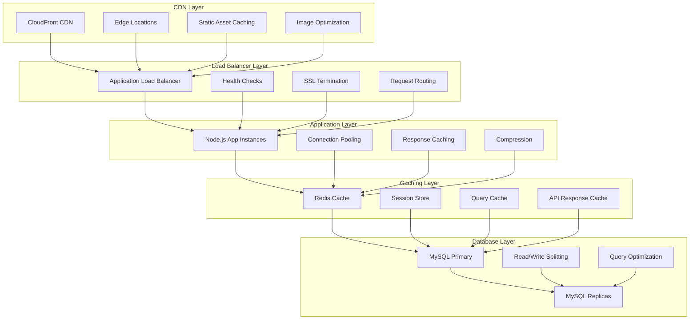
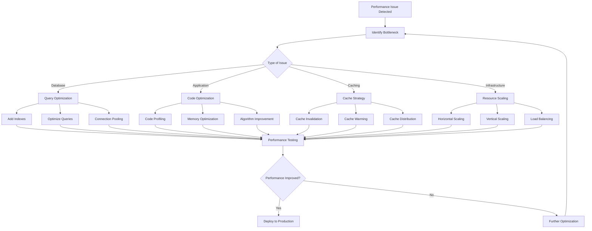
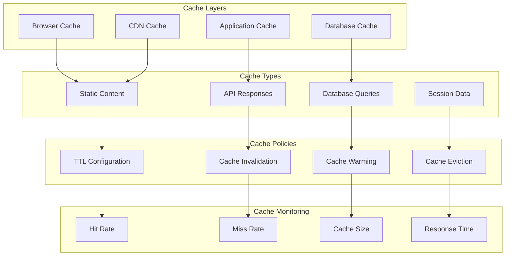
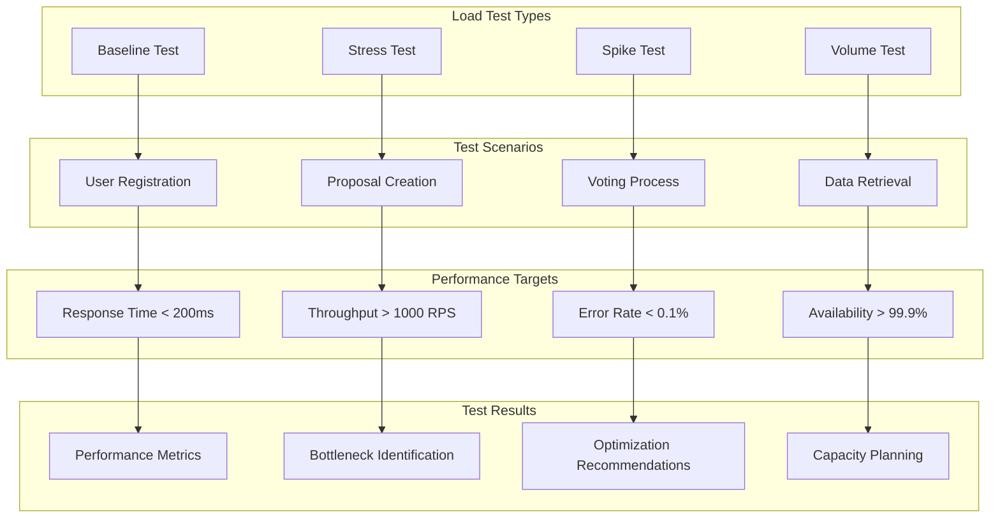
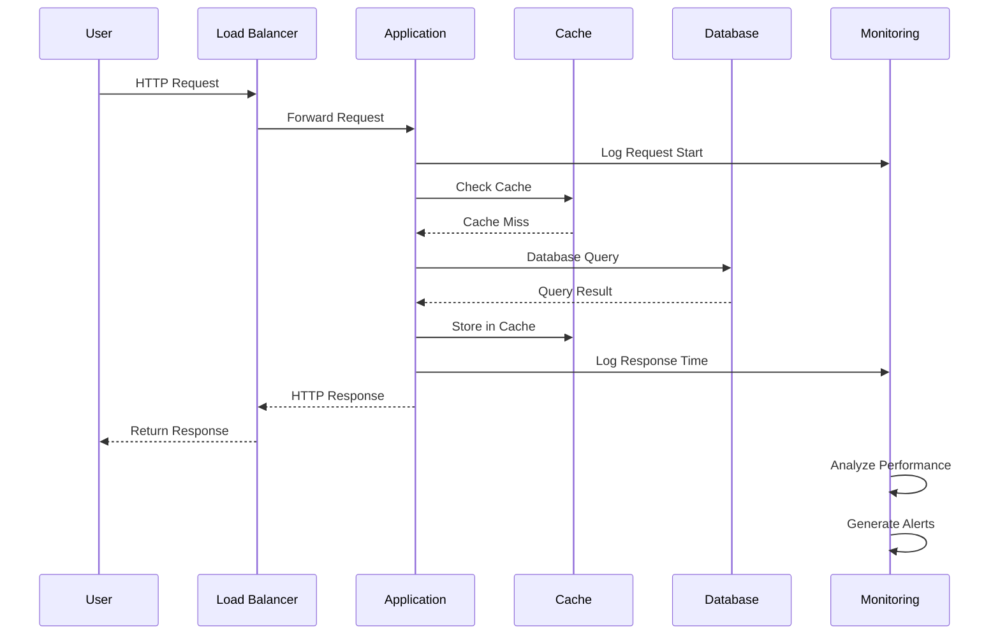

# Performance Diagram

## Performance Architecture Overview

## Performance Metrics Dashboard

```mermaid
graph TB
    subgraph "Response Time Metrics"
        A[API Response Time]
        B[Database Query Time]
        C[Cache Hit Time]
        D[External API Time]
    end
    
    subgraph "Throughput Metrics"
        E[Requests per Second]
        F[Concurrent Users]
        G[Database Connections]
        H[Cache Operations]
    end
    
    subgraph "Resource Metrics"
        I[CPU Usage]
        J[Memory Usage]
        K[Disk I/O]
        L[Network I/O]
    end
    
    subgraph "Error Metrics"
        M[Error Rate]
        N[Timeout Rate]
        O[Failed Requests]
        P[Database Errors]
    end
    
    A --> Q[Performance Dashboard]
    B --> Q
    C --> Q
    D --> Q
    E --> Q
    F --> Q
    G --> Q
    H --> Q
    I --> Q
    J --> Q
    K --> Q
    L --> Q
    M --> Q
    N --> Q
    O --> Q
    P --> Q
```

## Performance Optimization Flow

## Database Performance Optimization

```mermaid
graph TB
    subgraph "Query Optimization"
        A[Query Analysis]
        B[Index Optimization]
        C[Query Rewriting]
        D[Execution Plan Analysis]
    end
    
    subgraph "Connection Management"
        E[Connection Pooling]
        F[Connection Limits]
        G[Timeout Configuration]
        H[Connection Monitoring]
    end
    
    subgraph "Caching Strategy"
        I[Query Result Caching]
        J[Database Query Cache]
        K[Application Cache]
        L[Distributed Cache]
    end
    
    subgraph "Scaling Strategy"
        M[Read Replicas]
        N[Write Sharding]
        O[Partitioning]
        P[Load Balancing]
    end
    
    A --> Q[Performance Improvement]
    B --> Q
    C --> Q
    D --> Q
    E --> Q
    F --> Q
    G --> Q
    H --> Q
    I --> Q
    J --> Q
    K --> Q
    L --> Q
    M --> Q
    N --> Q
    O --> Q
    P --> Q
```

## Caching Strategy

## Load Testing Scenarios

## Performance Monitoring

## Performance Optimization Techniques

### Frontend Optimization

1. **Code Splitting**
   - Lazy loading components
   - Route-based splitting
   - Dynamic imports
   - Bundle optimization

2. **Caching Strategies**
   - Browser caching
   - Service worker caching
   - CDN caching
   - API response caching

3. **Image Optimization**
   - WebP format support
   - Lazy loading
   - Responsive images
   - Compression

### Backend Optimization

1. **Database Optimization**
   - Query optimization
   - Index optimization
   - Connection pooling
   - Read replicas

2. **Caching Implementation**
   - Redis caching
   - Query result caching
   - Session caching
   - API response caching

3. **Code Optimization**
   - Algorithm optimization
   - Memory management
   - Asynchronous processing
   - Resource pooling

### Infrastructure Optimization

1. **Load Balancing**
   - Round-robin distribution
   - Least connections
   - Health checks
   - SSL termination

2. **CDN Configuration**
   - Edge caching
   - Compression
   - Image optimization
   - Geographic distribution

3. **Monitoring and Alerting**
   - Performance metrics
   - Error tracking
   - Resource monitoring
   - Automated scaling

## Performance Benchmarks

### Response Time Targets

| Endpoint | Target | Warning | Critical |
|----------|--------|---------|----------|
| API Health Check | < 50ms | > 100ms | > 200ms |
| User Login | < 200ms | > 500ms | > 1000ms |
| Proposal List | < 300ms | > 600ms | > 1200ms |
| Vote Submission | < 400ms | > 800ms | > 1600ms |
| File Upload | < 2000ms | > 5000ms | > 10000ms |

### Throughput Targets

| Metric | Target | Warning | Critical |
|--------|--------|---------|----------|
| Requests per Second | > 1000 | < 500 | < 100 |
| Concurrent Users | > 5000 | < 2500 | < 500 |
| Database Connections | < 100 | > 150 | > 200 |
| Cache Hit Rate | > 90% | < 80% | < 70% |

### Resource Utilization

| Resource | Target | Warning | Critical |
|----------|--------|---------|----------|
| CPU Usage | < 70% | > 80% | > 90% |
| Memory Usage | < 80% | > 90% | > 95% |
| Disk I/O | < 80% | > 90% | > 95% |
| Network I/O | < 70% | > 80% | > 90% |

## Performance Testing Tools

### Load Testing

1. **K6**
   - Script-based testing
   - Cloud execution
   - Real-time monitoring
   - CI/CD integration

2. **Artillery**
   - YAML configuration
   - Realistic scenarios
   - Custom metrics
   - Reporting

3. **JMeter**
   - GUI-based testing
   - Protocol support
   - Plugin ecosystem
   - Detailed reporting

### Monitoring Tools

1. **Prometheus**
   - Metrics collection
   - Query language
   - Alerting
   - Service discovery

2. **Grafana**
   - Visualization
   - Dashboard creation
   - Alert management
   - Data source integration

3. **New Relic**
   - Application monitoring
   - Error tracking
   - Performance insights
   - User experience monitoring

## Conclusion

This performance diagram provides a comprehensive overview of performance optimization strategies for the REChain DAO Platform. Regular monitoring, testing, and optimization are essential for maintaining optimal performance.

For additional support, please refer to our [documentation](docs/) or contact our [support team](mailto:support@rechain-dao.com).
