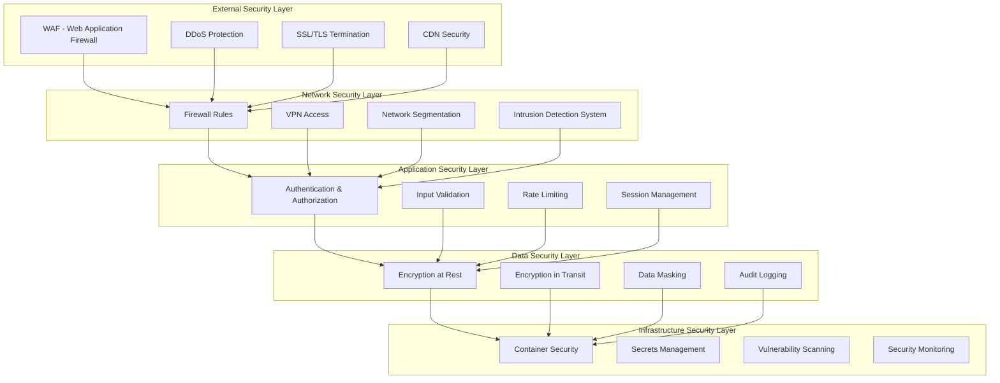
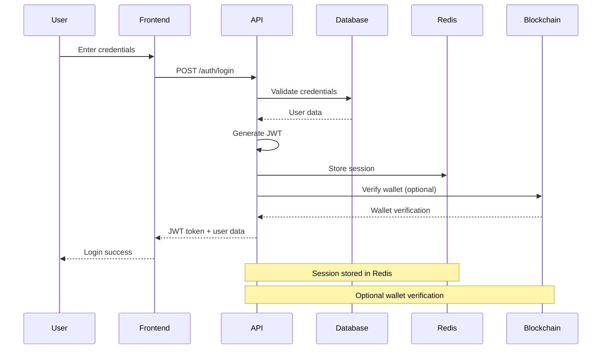
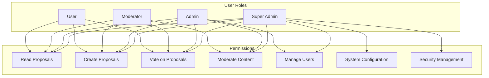
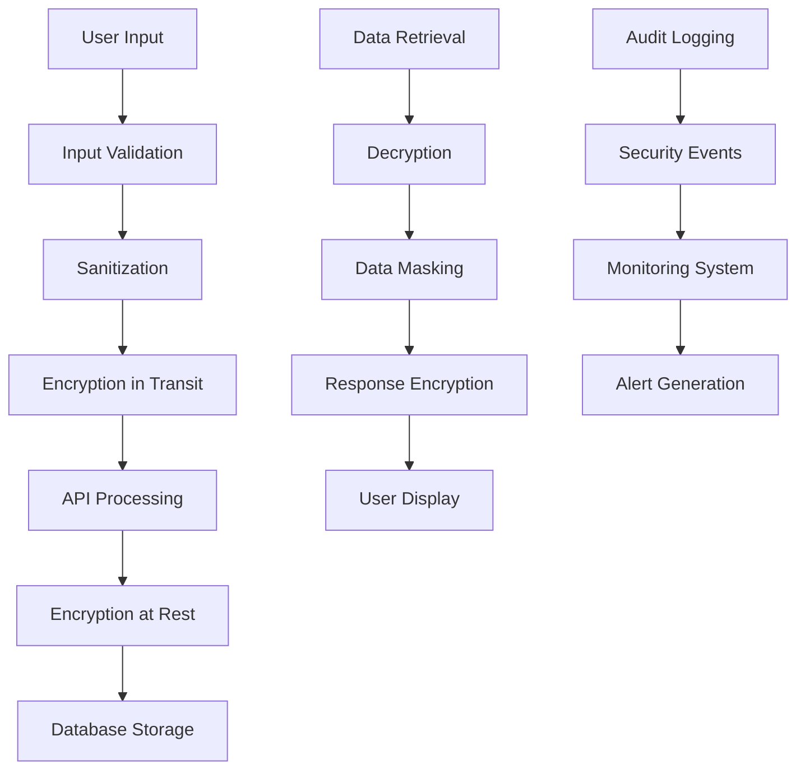
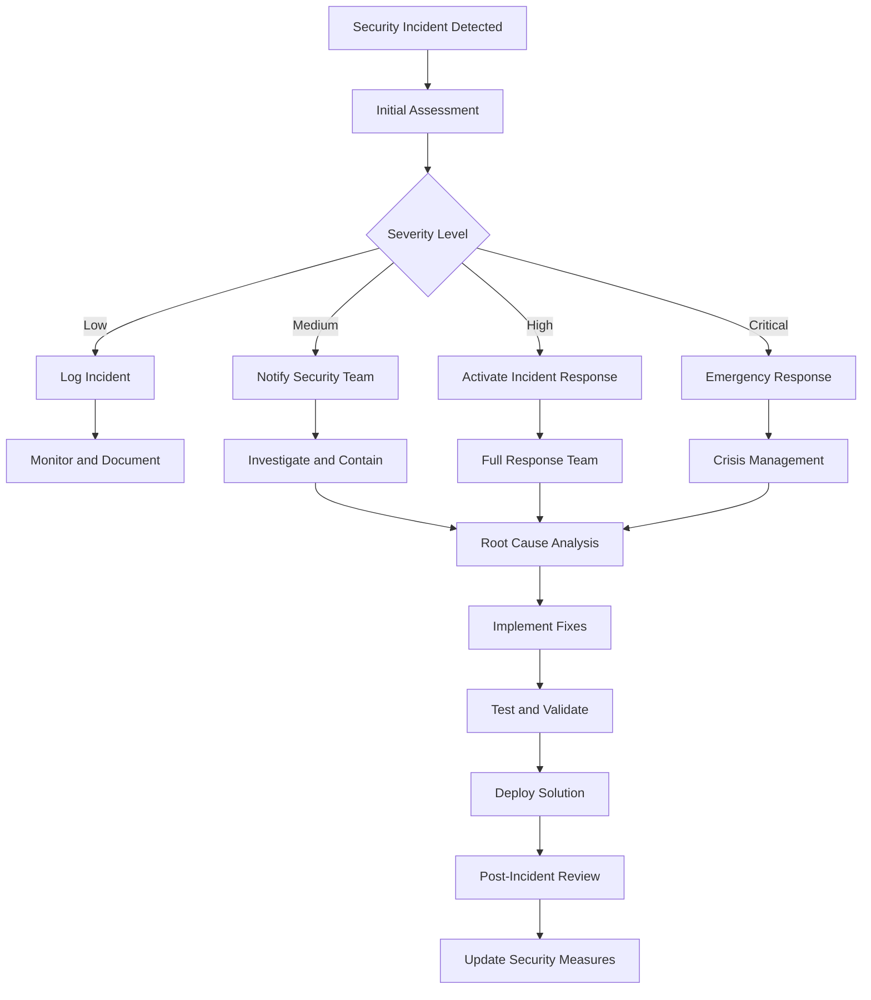
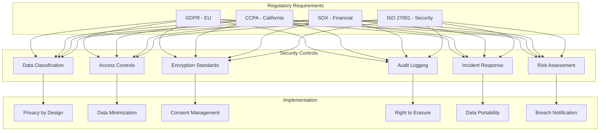
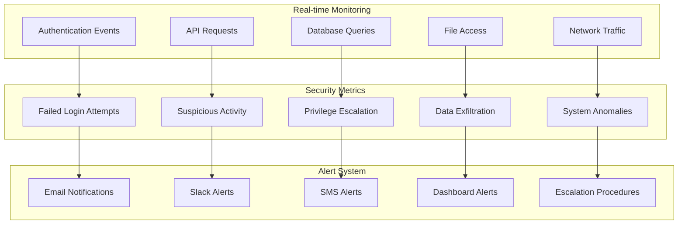
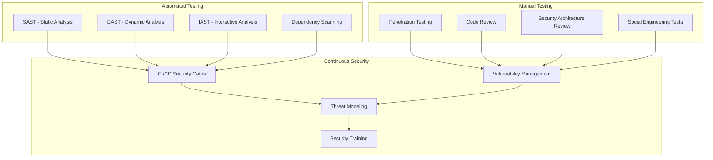

# Security Diagram

## Security Architecture Overview

## Authentication Flow

## Authorization Matrix

## Data Protection Flow

## Threat Model

```mermaid
graph TB
    subgraph "External Threats"
        A[SQL Injection]
        B[XSS Attacks]
        C[CSRF Attacks]
        D[DDoS Attacks]
        E[Brute Force]
    end
    
    subgraph "Internal Threats"
        F[Privilege Escalation]
        G[Data Exfiltration]
        H[Insider Threats]
        I[Configuration Errors]
    end
    
    subgraph "Infrastructure Threats"
        J[Container Escape]
        K[Network Intrusion]
        L[Supply Chain Attacks]
        M[Zero-Day Exploits]
    end
    
    subgraph "Mitigation Strategies"
        N[Input Validation]
        O[Output Encoding]
        P[CSRF Tokens]
        Q[Rate Limiting]
        R[Multi-Factor Auth]
        S[Network Segmentation]
        T[Vulnerability Scanning]
        U[Security Monitoring]
    end
    
    A --> N
    B --> O
    C --> P
    D --> Q
    E --> R
    F --> R
    G --> S
    H --> T
    I --> T
    J --> U
    K --> S
    L --> T
    M --> U
```

## Security Incident Response

## Compliance Framework

## Security Monitoring Dashboard

## Security Testing Framework

## Security Controls Implementation

### Technical Controls

1. **Authentication**
   - Multi-factor authentication
   - Strong password policies
   - Session management
   - Account lockout mechanisms

2. **Authorization**
   - Role-based access control
   - Principle of least privilege
   - Regular access reviews
   - Privileged access management

3. **Data Protection**
   - Encryption at rest and in transit
   - Data classification
   - Data loss prevention
   - Secure data disposal

4. **Network Security**
   - Firewall configuration
   - Network segmentation
   - VPN access
   - Intrusion detection

### Administrative Controls

1. **Security Policies**
   - Information security policy
   - Acceptable use policy
   - Incident response policy
   - Data protection policy

2. **Training and Awareness**
   - Security awareness training
   - Phishing simulation
   - Regular updates
   - Role-specific training

3. **Incident Management**
   - Incident response plan
   - Communication procedures
   - Recovery procedures
   - Lessons learned process

### Physical Controls

1. **Data Center Security**
   - Access controls
   - Environmental controls
   - Monitoring systems
   - Backup procedures

2. **Device Security**
   - Device encryption
   - Remote wipe capabilities
   - Device management
   - Secure disposal

## Security Metrics and KPIs

### Security Metrics

- **Mean Time to Detection (MTTD)**: Average time to detect security incidents
- **Mean Time to Response (MTTR)**: Average time to respond to incidents
- **Vulnerability Remediation Time**: Time to fix security vulnerabilities
- **Security Training Completion**: Percentage of users completing training
- **Incident Response Effectiveness**: Success rate of incident responses

### Compliance Metrics

- **Audit Findings**: Number and severity of audit findings
- **Compliance Score**: Overall compliance rating
- **Policy Adherence**: Percentage of policies being followed
- **Risk Assessment Coverage**: Percentage of systems assessed
- **Remediation Progress**: Progress on security improvements

## Conclusion

This security diagram provides a comprehensive overview of the security architecture, controls, and processes for the REChain DAO Platform. Regular security assessments, monitoring, and updates are essential for maintaining a secure environment.

For additional support, please refer to our [documentation](docs/) or contact our [security team](mailto:security@rechain-dao.com).
