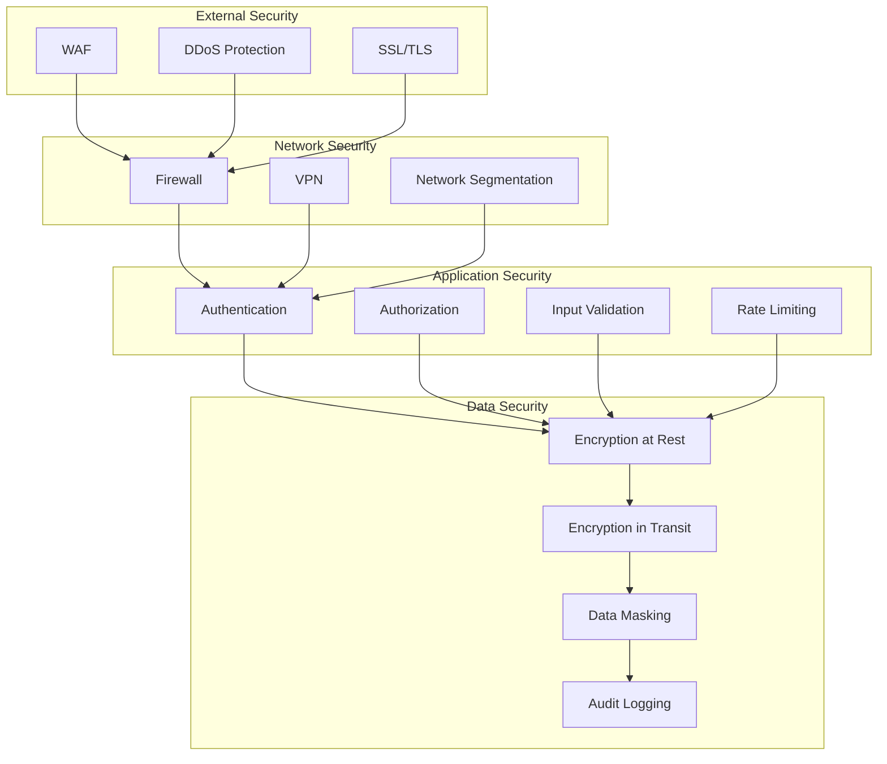

# Security Guide

## Overview

This guide provides comprehensive security strategies for the REChain DAO Platform, including authentication, authorization, data protection, and incident response.

## Table of Contents

1. [Security Architecture](#security-architecture)
2. [Authentication & Authorization](#authentication--authorization)
3. [Data Protection](#data-protection)
4. [Network Security](#network-security)
5. [Application Security](#application-security)
6. [Incident Response](#incident-response)
7. [Compliance](#compliance)

## Security Architecture

### Security Layers



## Authentication & Authorization

### JWT Implementation

```javascript
const jwt = require('jsonwebtoken');
const bcrypt = require('bcryptjs');

class AuthService {
  async hashPassword(password) {
    const saltRounds = 12;
    return await bcrypt.hash(password, saltRounds);
  }
  
  async verifyPassword(password, hash) {
    return await bcrypt.compare(password, hash);
  }
  
  generateToken(user) {
    return jwt.sign(
      { 
        userId: user.id, 
        email: user.email,
        role: user.role 
      },
      process.env.JWT_SECRET,
      { expiresIn: '1h' }
    );
  }
  
  verifyToken(token) {
    try {
      return jwt.verify(token, process.env.JWT_SECRET);
    } catch (error) {
      throw new Error('Invalid token');
    }
  }
}
```

### Role-Based Access Control

```javascript
const authorize = (roles) => {
  return (req, res, next) => {
    if (!req.user) {
      return res.status(401).json({ error: 'Authentication required' });
    }
    
    if (!roles.includes(req.user.role)) {
      return res.status(403).json({ error: 'Insufficient permissions' });
    }
    
    next();
  };
};

// Usage
app.get('/api/admin/users', 
  authenticateToken, 
  authorize(['admin', 'moderator']), 
  getUsers
);
```

### Multi-Factor Authentication

```javascript
const speakeasy = require('speakeasy');
const QRCode = require('qrcode');

class MFAService {
  generateSecret(user) {
    const secret = speakeasy.generateSecret({
      name: `REChain DAO (${user.email})`,
      issuer: 'REChain DAO'
    });
    
    return secret;
  }
  
  generateQRCode(secret) {
    return QRCode.toDataURL(secret.otpauth_url);
  }
  
  verifyToken(secret, token) {
    return speakeasy.totp.verify({
      secret: secret.base32,
      encoding: 'base32',
      token: token,
      window: 2
    });
  }
}
```

## Data Protection

### Encryption at Rest

```javascript
const crypto = require('crypto');

class EncryptionService {
  constructor() {
    this.algorithm = 'aes-256-gcm';
    this.key = crypto.scryptSync(process.env.ENCRYPTION_KEY, 'salt', 32);
  }
  
  encrypt(text) {
    const iv = crypto.randomBytes(16);
    const cipher = crypto.createCipher(this.algorithm, this.key);
    cipher.setAAD(Buffer.from('rechain-dao', 'utf8'));
    
    let encrypted = cipher.update(text, 'utf8', 'hex');
    encrypted += cipher.final('hex');
    
    const authTag = cipher.getAuthTag();
    
    return {
      encrypted,
      iv: iv.toString('hex'),
      authTag: authTag.toString('hex')
    };
  }
  
  decrypt(encryptedData) {
    const decipher = crypto.createDecipher(
      this.algorithm, 
      Buffer.from(encryptedData.iv, 'hex')
    );
    
    decipher.setAAD(Buffer.from('rechain-dao', 'utf8'));
    decipher.setAuthTag(Buffer.from(encryptedData.authTag, 'hex'));
    
    let decrypted = decipher.update(encryptedData.encrypted, 'hex', 'utf8');
    decrypted += decipher.final('utf8');
    
    return decrypted;
  }
}
```

### Data Masking

```javascript
class DataMaskingService {
  maskEmail(email) {
    const [local, domain] = email.split('@');
    const maskedLocal = local.charAt(0) + '*'.repeat(local.length - 2) + local.charAt(local.length - 1);
    return `${maskedLocal}@${domain}`;
  }
  
  maskPhone(phone) {
    return phone.replace(/(\d{3})\d{4}(\d{4})/, '$1****$2');
  }
  
  maskSensitiveData(data) {
    const masked = { ...data };
    
    if (masked.email) {
      masked.email = this.maskEmail(masked.email);
    }
    
    if (masked.phone) {
      masked.phone = this.maskPhone(masked.phone);
    }
    
    return masked;
  }
}
```

## Network Security

### SSL/TLS Configuration

```nginx
# nginx.conf
server {
    listen 443 ssl http2;
    server_name api.rechain-dao.com;
    
    # SSL configuration
    ssl_certificate /etc/ssl/certs/api.rechain-dao.com.crt;
    ssl_certificate_key /etc/ssl/private/api.rechain-dao.com.key;
    
    # SSL security
    ssl_protocols TLSv1.2 TLSv1.3;
    ssl_ciphers ECDHE-RSA-AES256-GCM-SHA512:DHE-RSA-AES256-GCM-SHA512;
    ssl_prefer_server_ciphers off;
    ssl_session_cache shared:SSL:10m;
    ssl_session_timeout 10m;
    ssl_session_tickets off;
    
    # HSTS
    add_header Strict-Transport-Security "max-age=31536000; includeSubDomains; preload" always;
    
    # Security headers
    add_header X-Frame-Options "SAMEORIGIN" always;
    add_header X-Content-Type-Options "nosniff" always;
    add_header X-XSS-Protection "1; mode=block" always;
    add_header Referrer-Policy "strict-origin-when-cross-origin" always;
}
```

### Firewall Configuration

```bash
#!/bin/bash
# firewall-setup.sh

# Enable UFW
ufw --force enable

# Default policies
ufw default deny incoming
ufw default allow outgoing

# Allow SSH
ufw allow 22/tcp

# Allow HTTP and HTTPS
ufw allow 80/tcp
ufw allow 443/tcp

# Allow specific ports for services
ufw allow 3000/tcp  # Application
ufw allow 3306/tcp  # MySQL
ufw allow 6379/tcp  # Redis

# Rate limiting
ufw limit ssh

# Logging
ufw logging on

# Show status
ufw status verbose
```

## Application Security

### Input Validation

```javascript
const validator = require('express-validator');
const { body, validationResult } = validator;

const validateProposal = [
  body('title')
    .trim()
    .isLength({ min: 5, max: 200 })
    .withMessage('Title must be between 5 and 200 characters')
    .escape(),
  body('description')
    .trim()
    .isLength({ min: 10, max: 5000 })
    .withMessage('Description must be between 10 and 5000 characters')
    .escape(),
  body('type')
    .isIn(['governance', 'treasury', 'technical', 'social'])
    .withMessage('Invalid proposal type'),
  (req, res, next) => {
    const errors = validationResult(req);
    if (!errors.isEmpty()) {
      return res.status(400).json({ errors: errors.array() });
    }
    next();
  }
];
```

### Rate Limiting

```javascript
const rateLimit = require('express-rate-limit');

// General rate limiting
const generalLimiter = rateLimit({
  windowMs: 15 * 60 * 1000, // 15 minutes
  max: 100, // limit each IP to 100 requests per windowMs
  message: 'Too many requests from this IP',
  standardHeaders: true,
  legacyHeaders: false,
});

// Strict rate limiting for sensitive endpoints
const strictLimiter = rateLimit({
  windowMs: 15 * 60 * 1000,
  max: 5,
  message: 'Too many attempts, please try again later',
  skipSuccessfulRequests: true,
});

app.use('/api/', generalLimiter);
app.use('/api/auth/', strictLimiter);
```

### SQL Injection Prevention

```javascript
const mysql = require('mysql2/promise');

const getProposal = async (id) => {
  const connection = await mysql.createConnection({
    host: process.env.DB_HOST,
    user: process.env.DB_USER,
    password: process.env.DB_PASSWORD,
    database: process.env.DB_NAME
  });
  
  // Use parameterized queries
  const [rows] = await connection.execute(
    'SELECT * FROM proposals WHERE id = ?',
    [id]
  );
  
  await connection.end();
  return rows[0];
};
```

## Incident Response

### Security Monitoring

```javascript
const winston = require('winston');

const securityLogger = winston.createLogger({
  level: 'info',
  format: winston.format.combine(
    winston.format.timestamp(),
    winston.format.json()
  ),
  transports: [
    new winston.transports.File({ filename: 'security.log' }),
    new winston.transports.Console()
  ]
});

class SecurityMonitor {
  logLoginAttempt(userId, success, ip) {
    securityLogger.info('Login attempt', {
      userId,
      success,
      ip,
      timestamp: new Date().toISOString()
    });
  }
  
  logSuspiciousActivity(activity, details) {
    securityLogger.warn('Suspicious activity', {
      activity,
      details,
      timestamp: new Date().toISOString()
    });
  }
  
  logSecurityEvent(event, severity, details) {
    securityLogger.error('Security event', {
      event,
      severity,
      details,
      timestamp: new Date().toISOString()
    });
  }
}
```

### Incident Response Plan

```markdown
# Incident Response Plan

## 1. Detection
- Monitor security logs
- Check system alerts
- Review user reports

## 2. Assessment
- Determine severity level
- Identify affected systems
- Assess potential impact

## 3. Containment
- Isolate affected systems
- Block malicious IPs
- Disable compromised accounts

## 4. Eradication
- Remove malware
- Patch vulnerabilities
- Update security measures

## 5. Recovery
- Restore systems
- Verify security
- Monitor for recurrence

## 6. Lessons Learned
- Document incident
- Update procedures
- Improve security
```

## Compliance

### GDPR Compliance

```javascript
class GDPRService {
  // Data subject rights
  async getPersonalData(userId) {
    const user = await User.findById(userId);
    const profile = await Profile.findOne({ userId });
    const votes = await Vote.find({ voterId: userId });
    
    return {
      personalData: {
        user,
        profile,
        votes
      },
      processingPurposes: [
        'Account management',
        'Voting participation',
        'Communication'
      ],
      dataRetention: '7 years'
    };
  }
  
  // Right to erasure
  async deletePersonalData(userId) {
    await User.findByIdAndDelete(userId);
    await Profile.findOneAndDelete({ userId });
    await Vote.deleteMany({ voterId: userId });
    
    // Anonymize audit logs
    await AuditLog.updateMany(
      { userId },
      { $set: { userId: null, anonymized: true } }
    );
  }
  
  // Data portability
  async exportPersonalData(userId) {
    const data = await this.getPersonalData(userId);
    return JSON.stringify(data, null, 2);
  }
}
```

### Security Audit Checklist

```markdown
# Security Audit Checklist

## Authentication
- [ ] Strong password requirements
- [ ] Multi-factor authentication enabled
- [ ] Account lockout after failed attempts
- [ ] Session timeout configured

## Authorization
- [ ] Role-based access control implemented
- [ ] Principle of least privilege applied
- [ ] Regular access reviews conducted
- [ ] Privileged access monitored

## Data Protection
- [ ] Encryption at rest enabled
- [ ] Encryption in transit enabled
- [ ] Data masking implemented
- [ ] Backup encryption configured

## Network Security
- [ ] Firewall rules configured
- [ ] VPN access required
- [ ] Network segmentation implemented
- [ ] Intrusion detection enabled

## Application Security
- [ ] Input validation implemented
- [ ] Output encoding configured
- [ ] SQL injection prevention
- [ ] XSS protection enabled

## Monitoring
- [ ] Security logging enabled
- [ ] Incident response plan
- [ ] Regular security assessments
- [ ] Penetration testing conducted
```

## Conclusion

This security guide provides comprehensive strategies for securing the REChain DAO Platform. Regular security audits, monitoring, and updates are essential for maintaining a secure environment.

For additional support, please refer to our [documentation](docs/) or contact our [security team](mailto:security@rechain-dao.com).