# System Architecture Diagrams

## Overview

This document provides comprehensive system architecture diagrams for the REChain DAO platform, including high-level architecture, component interactions, data flow, and deployment diagrams.

## Table of Contents

1. [High-Level Architecture](#high-level-architecture)
2. [Component Architecture](#component-architecture)
3. [Data Flow Diagrams](#data-flow-diagrams)
4. [Deployment Architecture](#deployment-architecture)
5. [Security Architecture](#security-architecture)
6. [Network Architecture](#network-architecture)

## High-Level Architecture

### System Overview
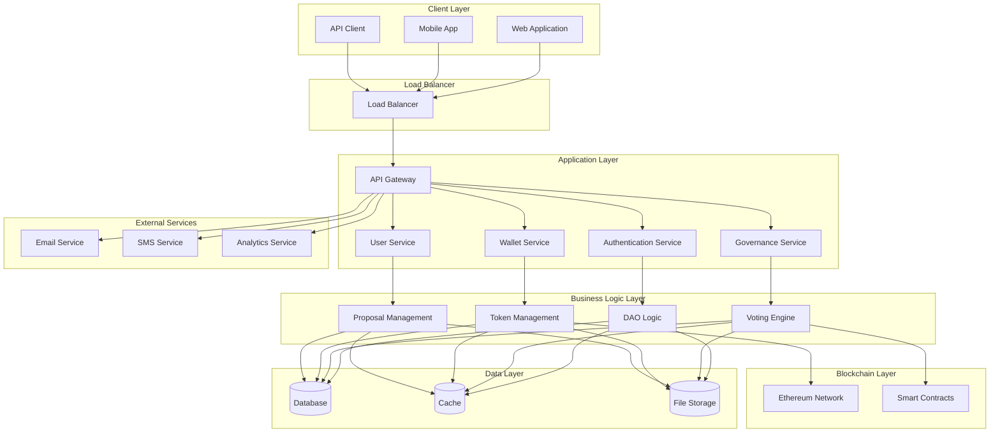

### Microservices Architecture
```mermaid
graph TB
    subgraph "API Gateway"
        GATEWAY[API Gateway]
        RATE_LIMIT[Rate Limiting]
        AUTH_MIDDLEWARE[Auth Middleware]
        LOGGING[Request Logging]
    end
    
    subgraph "Core Services"
        USER_SVC[User Service]
        AUTH_SVC[Auth Service]
        PROFILE_SVC[Profile Service]
        NOTIFICATION_SVC[Notification Service]
    end
    
    subgraph "DAO Services"
        PROPOSAL_SVC[Proposal Service]
        VOTING_SVC[Voting Service]
        GOVERNANCE_SVC[Governance Service]
        TREASURY_SVC[Treasury Service]
    end
    
    subgraph "Blockchain Services"
        WALLET_SVC[Wallet Service]
        TOKEN_SVC[Token Service]
        CONTRACT_SVC[Contract Service]
        TRANSACTION_SVC[Transaction Service]
    end
    
    subgraph "Support Services"
        FILE_SVC[File Service]
        EMAIL_SVC[Email Service]
        SMS_SVC[SMS Service]
        ANALYTICS_SVC[Analytics Service]
    end
    
    subgraph "Data Services"
        DB_SVC[Database Service]
        CACHE_SVC[Cache Service]
        SEARCH_SVC[Search Service]
        QUEUE_SVC[Queue Service]
    end
    
    GATEWAY --> USER_SVC
    GATEWAY --> AUTH_SVC
    GATEWAY --> PROFILE_SVC
    GATEWAY --> NOTIFICATION_SVC
    
    GATEWAY --> PROPOSAL_SVC
    GATEWAY --> VOTING_SVC
    GATEWAY --> GOVERNANCE_SVC
    GATEWAY --> TREASURY_SVC
    
    GATEWAY --> WALLET_SVC
    GATEWAY --> TOKEN_SVC
    GATEWAY --> CONTRACT_SVC
    GATEWAY --> TRANSACTION_SVC
    
    GATEWAY --> FILE_SVC
    GATEWAY --> EMAIL_SVC
    GATEWAY --> SMS_SVC
    GATEWAY --> ANALYTICS_SVC
    
    USER_SVC --> DB_SVC
    AUTH_SVC --> DB_SVC
    PROFILE_SVC --> DB_SVC
    NOTIFICATION_SVC --> DB_SVC
    
    PROPOSAL_SVC --> DB_SVC
    VOTING_SVC --> DB_SVC
    GOVERNANCE_SVC --> DB_SVC
    TREASURY_SVC --> DB_SVC
    
    WALLET_SVC --> DB_SVC
    TOKEN_SVC --> DB_SVC
    CONTRACT_SVC --> DB_SVC
    TRANSACTION_SVC --> DB_SVC
    
    FILE_SVC --> DB_SVC
    EMAIL_SVC --> DB_SVC
    SMS_SVC --> DB_SVC
    ANALYTICS_SVC --> DB_SVC
    
    USER_SVC --> CACHE_SVC
    AUTH_SVC --> CACHE_SVC
    PROFILE_SVC --> CACHE_SVC
    NOTIFICATION_SVC --> CACHE_SVC
    
    PROPOSAL_SVC --> CACHE_SVC
    VOTING_SVC --> CACHE_SVC
    GOVERNANCE_SVC --> CACHE_SVC
    TREASURY_SVC --> CACHE_SVC
    
    WALLET_SVC --> CACHE_SVC
    TOKEN_SVC --> CACHE_SVC
    CONTRACT_SVC --> CACHE_SVC
    TRANSACTION_SVC --> CACHE_SVC
    
    FILE_SVC --> CACHE_SVC
    EMAIL_SVC --> CACHE_SVC
    SMS_SVC --> CACHE_SVC
    ANALYTICS_SVC --> CACHE_SVC
```

## Component Architecture

### User Management Component
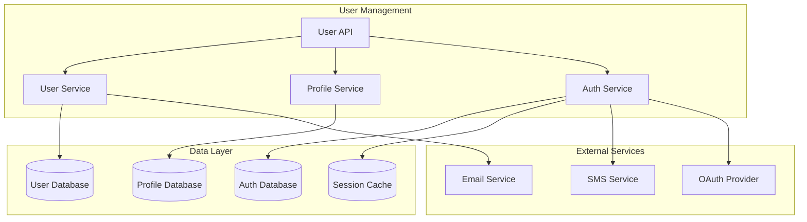

### Governance Component
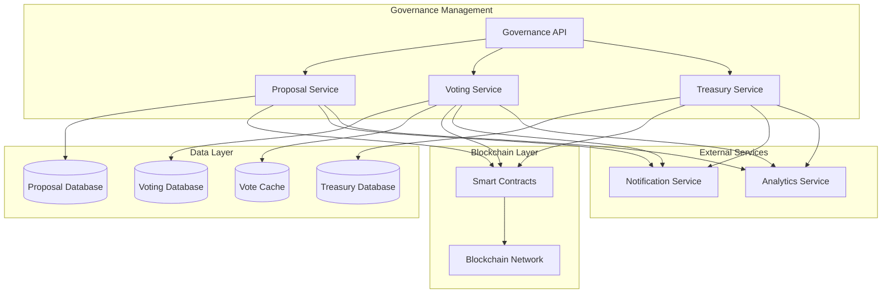

### Wallet Component
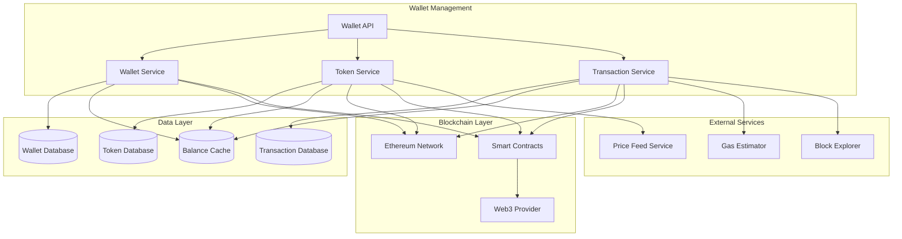

## Data Flow Diagrams

### User Registration Flow
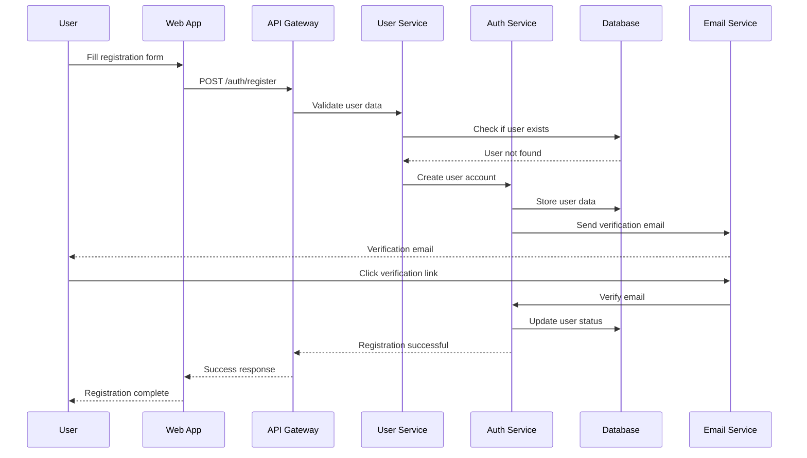

### Proposal Creation Flow
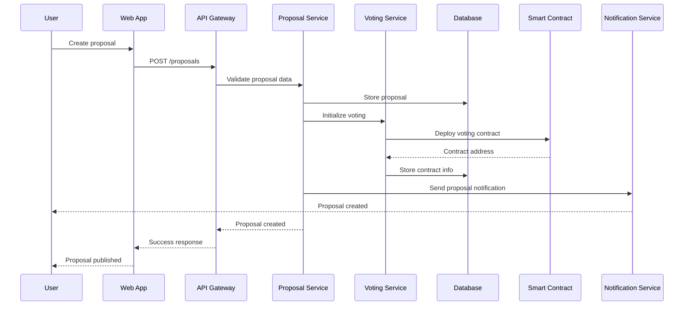

### Voting Flow
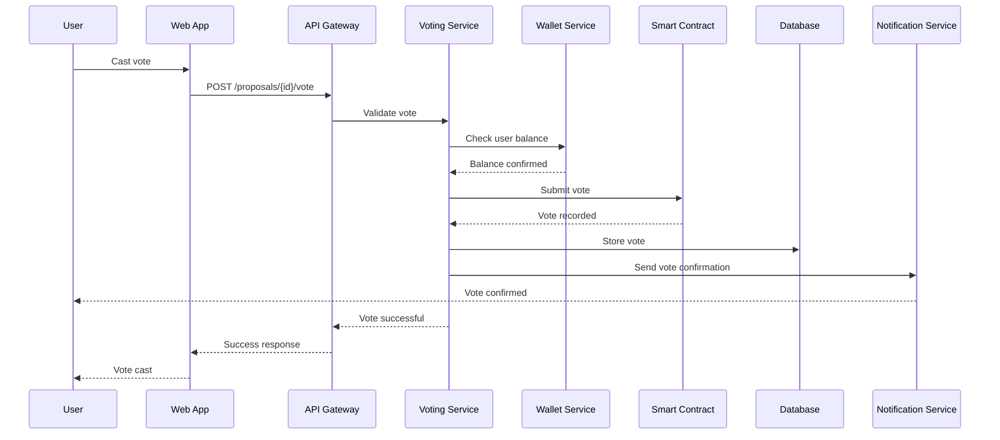

## Deployment Architecture

### Production Deployment
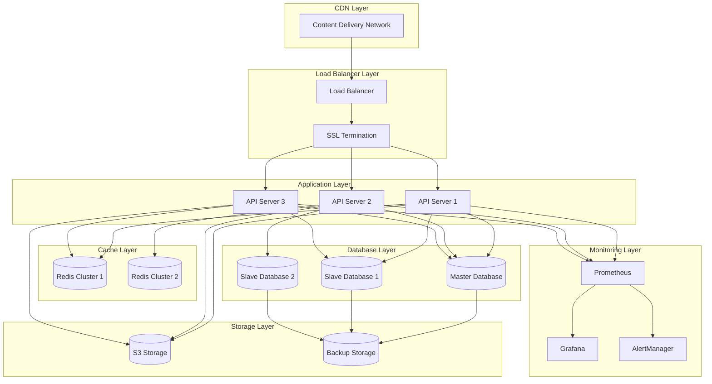

### Kubernetes Deployment
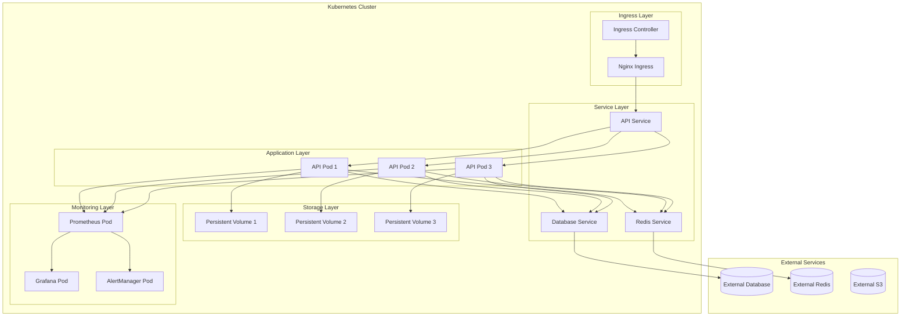

## Security Architecture

### Security Layers
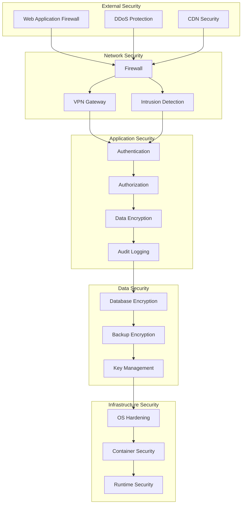

### Authentication Flow
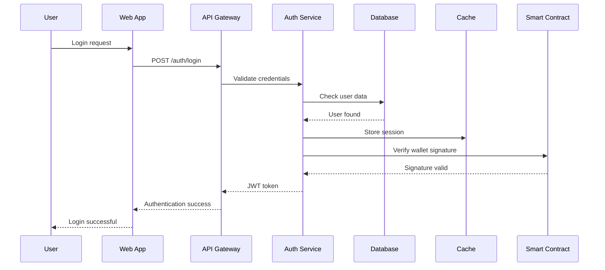

## Network Architecture

### Network Topology
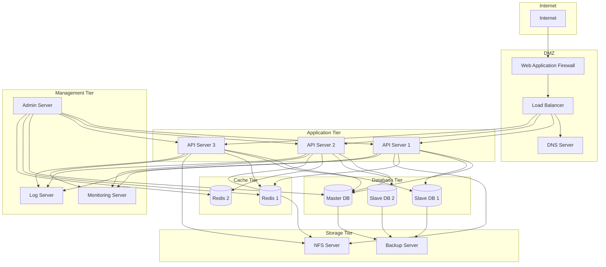

## Conclusion

These system architecture diagrams provide comprehensive visual representations of the REChain DAO platform's architecture, including component interactions, data flows, deployment strategies, and security measures. They serve as essential documentation for developers, architects, and stakeholders to understand the system's design and implementation.

Remember: Architecture diagrams should be regularly updated to reflect changes in the system. They are living documents that evolve with the platform and should be maintained alongside the codebase.
