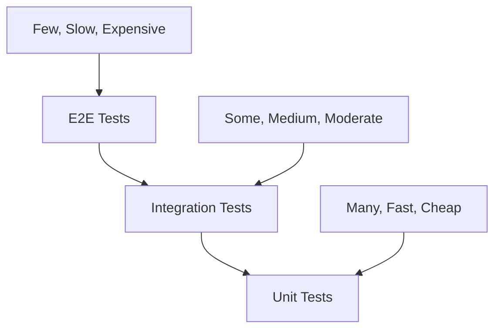

# Testing Guide

## Overview

This guide provides comprehensive testing strategies for the REChain DAO Platform, including unit tests, integration tests, end-to-end tests, and performance tests.

## Table of Contents

1. [Testing Strategy](#testing-strategy)
2. [Unit Testing](#unit-testing)
3. [Integration Testing](#integration-testing)
4. [End-to-End Testing](#end-to-end-testing)
5. [Performance Testing](#performance-testing)
6. [Security Testing](#security-testing)
7. [Test Automation](#test-automation)

## Testing Strategy

### Testing Pyramid



### Test Types

1. **Unit Tests** (70%)
   - Fast execution
   - Isolated testing
   - High coverage
   - Mock dependencies

2. **Integration Tests** (20%)
   - Test component interactions
   - Use real databases
   - Test API endpoints
   - Moderate coverage

3. **End-to-End Tests** (10%)
   - Full user workflows
   - Real browser testing
   - Critical user paths
   - Low coverage, high confidence

## Unit Testing

### Test Setup

```javascript
// test/setup.js
const { MongoMemoryServer } = require('mongodb-memory-server');
const mongoose = require('mongoose');

let mongoServer;

beforeAll(async () => {
  mongoServer = await MongoMemoryServer.create();
  const mongoUri = mongoServer.getUri();
  await mongoose.connect(mongoUri);
});

afterAll(async () => {
  await mongoose.disconnect();
  await mongoServer.stop();
});

beforeEach(async () => {
  // Clean database before each test
  const collections = mongoose.connection.collections;
  for (const key in collections) {
    const collection = collections[key];
    await collection.deleteMany({});
  }
});
```

### Service Tests

```javascript
// test/services/ProposalService.test.js
const ProposalService = require('../../src/services/ProposalService');
const Proposal = require('../../src/models/Proposal');
const User = require('../../src/models/User');

describe('ProposalService', () => {
  let proposalService;
  let testUser;

  beforeEach(() => {
    proposalService = new ProposalService();
    testUser = new User({
      email: 'test@example.com',
      firstName: 'Test',
      lastName: 'User'
    });
  });

  describe('createProposal', () => {
    it('should create a proposal with valid data', async () => {
      const proposalData = {
        title: 'Test Proposal',
        description: 'Test Description',
        type: 'governance',
        proposerId: testUser._id
      };

      const proposal = await proposalService.createProposal(proposalData);

      expect(proposal).toBeDefined();
      expect(proposal.title).toBe(proposalData.title);
      expect(proposal.status).toBe('draft');
    });

    it('should throw error for invalid proposal data', async () => {
      const invalidData = {
        title: '', // Empty title
        description: 'Test Description',
        type: 'invalid_type'
      };

      await expect(proposalService.createProposal(invalidData))
        .rejects.toThrow('Invalid proposal data');
    });
  });

  describe('getProposals', () => {
    it('should return proposals with pagination', async () => {
      // Create test proposals
      await Proposal.create([
        { title: 'Proposal 1', proposerId: testUser._id },
        { title: 'Proposal 2', proposerId: testUser._id }
      ]);

      const result = await proposalService.getProposals({ page: 1, limit: 10 });

      expect(result.data).toHaveLength(2);
      expect(result.pagination.total).toBe(2);
    });
  });
});
```

### Controller Tests

```javascript
// test/controllers/ProposalController.test.js
const request = require('supertest');
const app = require('../../src/app');
const Proposal = require('../../src/models/Proposal');
const User = require('../../src/models/User');

describe('ProposalController', () => {
  let authToken;
  let testUser;

  beforeEach(async () => {
    // Create test user and get auth token
    testUser = await User.create({
      email: 'test@example.com',
      password: 'password123'
    });
    
    const response = await request(app)
      .post('/api/auth/login')
      .send({
        email: 'test@example.com',
        password: 'password123'
      });
    
    authToken = response.body.token;
  });

  describe('GET /api/proposals', () => {
    it('should return proposals for authenticated user', async () => {
      const response = await request(app)
        .get('/api/proposals')
        .set('Authorization', `Bearer ${authToken}`)
        .expect(200);

      expect(response.body.data).toBeDefined();
      expect(Array.isArray(response.body.data)).toBe(true);
    });

    it('should return 401 for unauthenticated user', async () => {
      await request(app)
        .get('/api/proposals')
        .expect(401);
    });
  });

  describe('POST /api/proposals', () => {
    it('should create proposal with valid data', async () => {
      const proposalData = {
        title: 'Test Proposal',
        description: 'Test Description',
        type: 'governance'
      };

      const response = await request(app)
        .post('/api/proposals')
        .set('Authorization', `Bearer ${authToken}`)
        .send(proposalData)
        .expect(201);

      expect(response.body.title).toBe(proposalData.title);
      expect(response.body.proposerId).toBe(testUser._id.toString());
    });
  });
});
```

## Integration Testing

### Database Integration

```javascript
// test/integration/DatabaseIntegration.test.js
const mongoose = require('mongoose');
const Proposal = require('../../src/models/Proposal');
const User = require('../../src/models/User');
const Vote = require('../../src/models/Vote');

describe('Database Integration', () => {
  beforeAll(async () => {
    await mongoose.connect(process.env.TEST_DATABASE_URL);
  });

  afterAll(async () => {
    await mongoose.disconnect();
  });

  beforeEach(async () => {
    // Clean database
    await Proposal.deleteMany({});
    await User.deleteMany({});
    await Vote.deleteMany({});
  });

  it('should create proposal with user relationship', async () => {
    const user = await User.create({
      email: 'test@example.com',
      firstName: 'Test',
      lastName: 'User'
    });

    const proposal = await Proposal.create({
      title: 'Test Proposal',
      description: 'Test Description',
      proposerId: user._id
    });

    const populatedProposal = await Proposal.findById(proposal._id)
      .populate('proposerId');

    expect(populatedProposal.proposerId.email).toBe('test@example.com');
  });

  it('should handle vote aggregation', async () => {
    const user = await User.create({
      email: 'test@example.com',
      firstName: 'Test',
      lastName: 'User'
    });

    const proposal = await Proposal.create({
      title: 'Test Proposal',
      description: 'Test Description',
      proposerId: user._id
    });

    await Vote.create([
      { proposalId: proposal._id, voterId: user._id, voteType: 'yes' },
      { proposalId: proposal._id, voterId: user._id, voteType: 'no' }
    ]);

    const voteCount = await Vote.countDocuments({ proposalId: proposal._id });
    expect(voteCount).toBe(2);
  });
});
```

### API Integration

```javascript
// test/integration/APIIntegration.test.js
const request = require('supertest');
const app = require('../../src/app');
const mongoose = require('mongoose');

describe('API Integration', () => {
  let authToken;
  let testUser;

  beforeAll(async () => {
    await mongoose.connect(process.env.TEST_DATABASE_URL);
  });

  afterAll(async () => {
    await mongoose.disconnect();
  });

  beforeEach(async () => {
    // Setup test data
    const response = await request(app)
      .post('/api/auth/register')
      .send({
        email: 'test@example.com',
        password: 'password123',
        firstName: 'Test',
        lastName: 'User'
      });
    
    authToken = response.body.token;
    testUser = response.body.user;
  });

  it('should complete full proposal workflow', async () => {
    // Create proposal
    const createResponse = await request(app)
      .post('/api/proposals')
      .set('Authorization', `Bearer ${authToken}`)
      .send({
        title: 'Test Proposal',
        description: 'Test Description',
        type: 'governance'
      })
      .expect(201);

    const proposalId = createResponse.body._id;

    // Vote on proposal
    await request(app)
      .post('/api/votes')
      .set('Authorization', `Bearer ${authToken}`)
      .send({
        proposalId,
        voteType: 'yes'
      })
      .expect(201);

    // Get proposal with votes
    const getResponse = await request(app)
      .get(`/api/proposals/${proposalId}`)
      .set('Authorization', `Bearer ${authToken}`)
      .expect(200);

    expect(getResponse.body.totalVotes).toBe(1);
    expect(getResponse.body.yesVotes).toBe(1);
  });
});
```

## End-to-End Testing

### Cypress Setup

```javascript
// cypress.config.js
const { defineConfig } = require('cypress');

module.exports = defineConfig({
  e2e: {
    baseUrl: 'http://localhost:3000',
    viewportWidth: 1280,
    viewportHeight: 720,
    video: true,
    screenshotOnRunFailure: true,
    defaultCommandTimeout: 10000,
    requestTimeout: 10000,
    responseTimeout: 10000,
    setupNodeEvents(on, config) {
      // implement node event listeners here
    },
  },
});
```

### E2E Test Examples

```javascript
// cypress/e2e/user-journey.cy.js
describe('User Journey', () => {
  beforeEach(() => {
    cy.visit('/');
  });

  it('should complete user registration and first vote', () => {
    // Register new user
    cy.get('[data-cy=register-button]').click();
    cy.get('[data-cy=email-input]').type('test@example.com');
    cy.get('[data-cy=password-input]').type('password123');
    cy.get('[data-cy=firstName-input]').type('Test');
    cy.get('[data-cy=lastName-input]').type('User');
    cy.get('[data-cy=register-submit]').click();

    // Should redirect to dashboard
    cy.url().should('include', '/dashboard');
    cy.get('[data-cy=welcome-message]').should('contain', 'Welcome, Test');

    // View proposals
    cy.get('[data-cy=proposals-link]').click();
    cy.get('[data-cy=proposal-list]').should('be.visible');

    // Vote on first proposal
    cy.get('[data-cy=proposal-item]').first().click();
    cy.get('[data-cy=vote-yes]').click();
    cy.get('[data-cy=vote-submit]').click();

    // Should show success message
    cy.get('[data-cy=vote-success]').should('be.visible');
  });

  it('should create and manage proposal', () => {
    // Login
    cy.login('test@example.com', 'password123');

    // Create proposal
    cy.get('[data-cy=create-proposal]').click();
    cy.get('[data-cy=proposal-title]').type('Test Proposal');
    cy.get('[data-cy=proposal-description]').type('This is a test proposal');
    cy.get('[data-cy=proposal-type]').select('governance');
    cy.get('[data-cy=proposal-submit]').click();

    // Should show success message
    cy.get('[data-cy=proposal-success]').should('be.visible');

    // Should redirect to proposal detail
    cy.url().should('include', '/proposals/');
    cy.get('[data-cy=proposal-title]').should('contain', 'Test Proposal');
  });
});
```

### Custom Commands

```javascript
// cypress/support/commands.js
Cypress.Commands.add('login', (email, password) => {
  cy.visit('/login');
  cy.get('[data-cy=email-input]').type(email);
  cy.get('[data-cy=password-input]').type(password);
  cy.get('[data-cy=login-submit]').click();
  cy.url().should('include', '/dashboard');
});

Cypress.Commands.add('createProposal', (proposalData) => {
  cy.get('[data-cy=create-proposal]').click();
  cy.get('[data-cy=proposal-title]').type(proposalData.title);
  cy.get('[data-cy=proposal-description]').type(proposalData.description);
  cy.get('[data-cy=proposal-type]').select(proposalData.type);
  cy.get('[data-cy=proposal-submit]').click();
});
```

## Performance Testing

### Load Testing with K6

```javascript
// tests/performance/load-test.js
import http from 'k6/http';
import { check, sleep } from 'k6';
import { Rate } from 'k6/metrics';

const errorRate = new Rate('errors');

export const options = {
  stages: [
    { duration: '2m', target: 100 },
    { duration: '5m', target: 100 },
    { duration: '2m', target: 200 },
    { duration: '5m', target: 200 },
    { duration: '2m', target: 0 },
  ],
  thresholds: {
    http_req_duration: ['p(95)<500'],
    http_req_failed: ['rate<0.1'],
    errors: ['rate<0.1'],
  },
};

const BASE_URL = 'http://localhost:3000';

export function setup() {
  const loginResponse = http.post(`${BASE_URL}/api/auth/login`, {
    email: 'test@example.com',
    password: 'password123'
  });
  
  return {
    authToken: loginResponse.json('token')
  };
}

export default function(data) {
  const params = {
    headers: {
      'Authorization': `Bearer ${data.authToken}`,
      'Content-Type': 'application/json',
    },
  };

  // Test proposals endpoint
  const proposalsResponse = http.get(`${BASE_URL}/api/proposals`, params);
  check(proposalsResponse, {
    'proposals status is 200': (r) => r.status === 200,
    'proposals response time < 500ms': (r) => r.timings.duration < 500,
  });
  errorRate.add(proposalsResponse.status !== 200);

  sleep(1);
}
```

### Stress Testing

```javascript
// tests/performance/stress-test.js
import http from 'k6/http';
import { check, sleep } from 'k6';

export const options = {
  stages: [
    { duration: '1m', target: 10 },
    { duration: '2m', target: 50 },
    { duration: '3m', target: 100 },
    { duration: '2m', target: 200 },
    { duration: '1m', target: 0 },
  ],
  thresholds: {
    http_req_duration: ['p(95)<1000'],
    http_req_failed: ['rate<0.05'],
  },
};

export default function() {
  const response = http.get('http://localhost:3000/api/proposals');
  check(response, {
    'status is 200': (r) => r.status === 200,
    'response time < 1000ms': (r) => r.timings.duration < 1000,
  });
  
  sleep(1);
}
```

## Security Testing

### Authentication Tests

```javascript
// test/security/Authentication.test.js
const request = require('supertest');
const app = require('../../src/app');

describe('Authentication Security', () => {
  it('should reject invalid JWT tokens', async () => {
    const response = await request(app)
      .get('/api/proposals')
      .set('Authorization', 'Bearer invalid-token')
      .expect(401);
  });

  it('should reject expired JWT tokens', async () => {
    const expiredToken = 'eyJhbGciOiJIUzI1NiIsInR5cCI6IkpXVCJ9...';
    
    const response = await request(app)
      .get('/api/proposals')
      .set('Authorization', `Bearer ${expiredToken}`)
      .expect(401);
  });

  it('should rate limit login attempts', async () => {
    const loginData = {
      email: 'test@example.com',
      password: 'wrongpassword'
    };

    // Make multiple failed login attempts
    for (let i = 0; i < 6; i++) {
      await request(app)
        .post('/api/auth/login')
        .send(loginData);
    }

    // Should be rate limited
    const response = await request(app)
      .post('/api/auth/login')
      .send(loginData)
      .expect(429);
  });
});
```

### Input Validation Tests

```javascript
// test/security/InputValidation.test.js
const request = require('supertest');
const app = require('../../src/app');

describe('Input Validation Security', () => {
  it('should prevent SQL injection in proposal search', async () => {
    const maliciousInput = "'; DROP TABLE proposals; --";
    
    const response = await request(app)
      .get(`/api/proposals?search=${maliciousInput}`)
      .expect(400);
  });

  it('should prevent XSS in proposal title', async () => {
    const xssPayload = '<script>alert("XSS")</script>';
    
    const response = await request(app)
      .post('/api/proposals')
      .send({
        title: xssPayload,
        description: 'Test description',
        type: 'governance'
      })
      .expect(400);
  });

  it('should validate file upload types', async () => {
    const response = await request(app)
      .post('/api/upload')
      .attach('file', Buffer.from('malicious content'), 'malicious.exe')
      .expect(400);
  });
});
```

## Test Automation

### CI/CD Integration

```yaml
# .github/workflows/test.yml
name: Test

on:
  push:
    branches: [ main, develop ]
  pull_request:
    branches: [ main, develop ]

jobs:
  unit-tests:
    runs-on: ubuntu-latest
    steps:
    - uses: actions/checkout@v4
    - uses: actions/setup-node@v4
      with:
        node-version: '18'
        cache: 'npm'
    - run: npm ci
    - run: npm run test:unit
    - uses: codecov/codecov-action@v3

  integration-tests:
    runs-on: ubuntu-latest
    services:
      mysql:
        image: mysql:8.0
        env:
          MYSQL_ROOT_PASSWORD: root
          MYSQL_DATABASE: rechain_dao_test
        options: >-
          --health-cmd="mysqladmin ping"
          --health-interval=10s
          --health-timeout=5s
          --health-retries=3
        ports:
          - 3306:3306
    steps:
    - uses: actions/checkout@v4
    - uses: actions/setup-node@v4
      with:
        node-version: '18'
        cache: 'npm'
    - run: npm ci
    - run: npm run test:integration

  e2e-tests:
    runs-on: ubuntu-latest
    steps:
    - uses: actions/checkout@v4
    - uses: actions/setup-node@v4
      with:
        node-version: '18'
        cache: 'npm'
    - run: npm ci
    - run: npm run build
    - run: npm start &
    - run: npm run test:e2e
```

### Test Data Management

```javascript
// test/fixtures/testData.js
const testData = {
  users: [
    {
      email: 'test@example.com',
      password: 'password123',
      firstName: 'Test',
      lastName: 'User'
    }
  ],
  proposals: [
    {
      title: 'Test Proposal 1',
      description: 'Test Description 1',
      type: 'governance',
      status: 'active'
    }
  ]
};

module.exports = testData;
```

## Conclusion

This testing guide provides comprehensive strategies for testing the REChain DAO Platform. Regular testing ensures code quality, reliability, and user satisfaction.

For additional support, please refer to our [documentation](docs/) or contact our [support team](mailto:support@rechain-dao.com).
