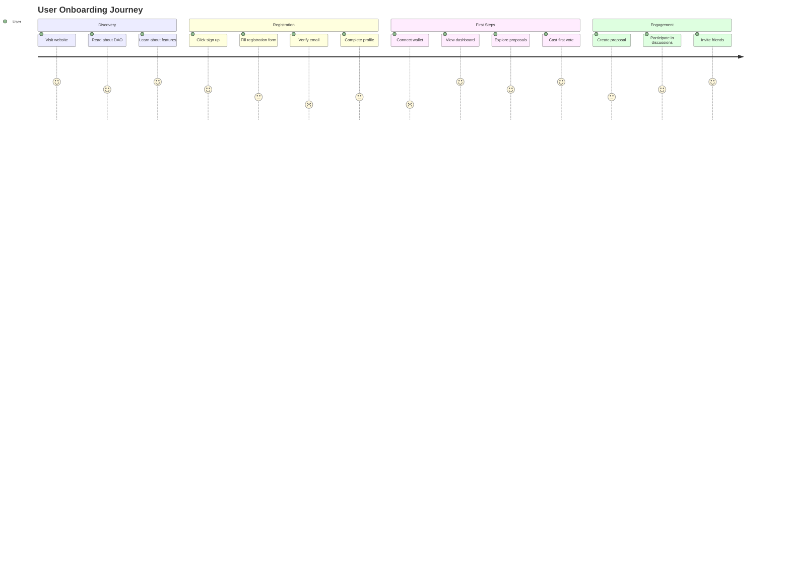
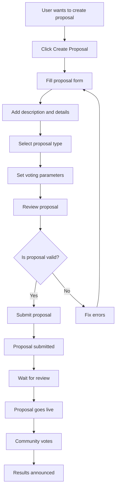
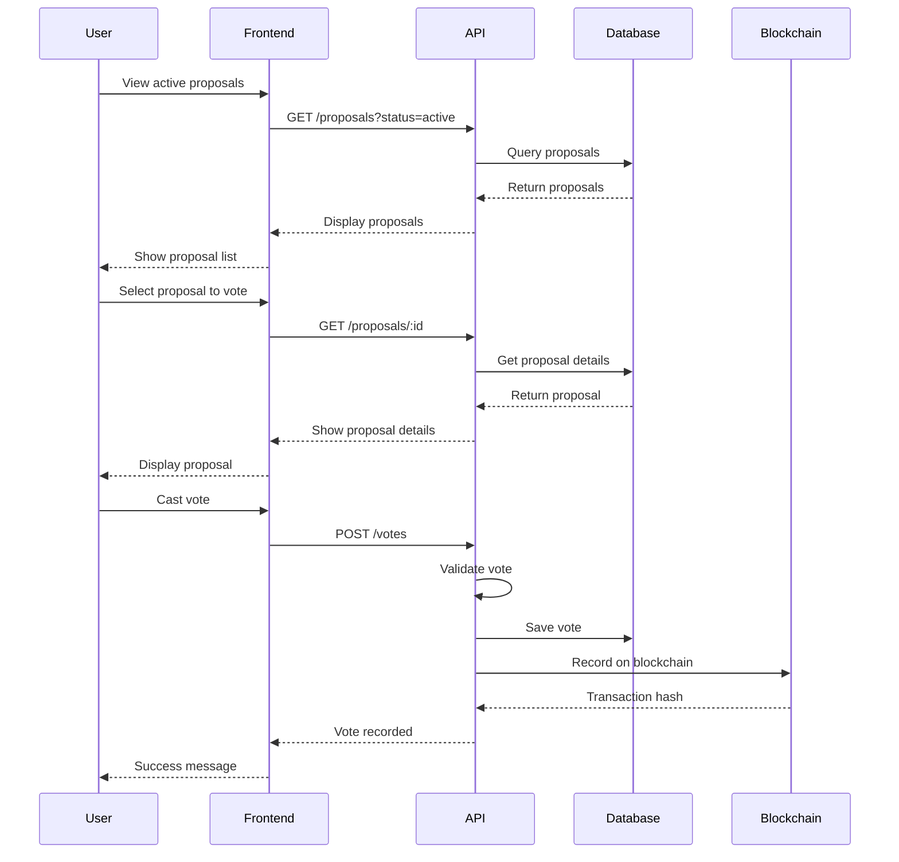
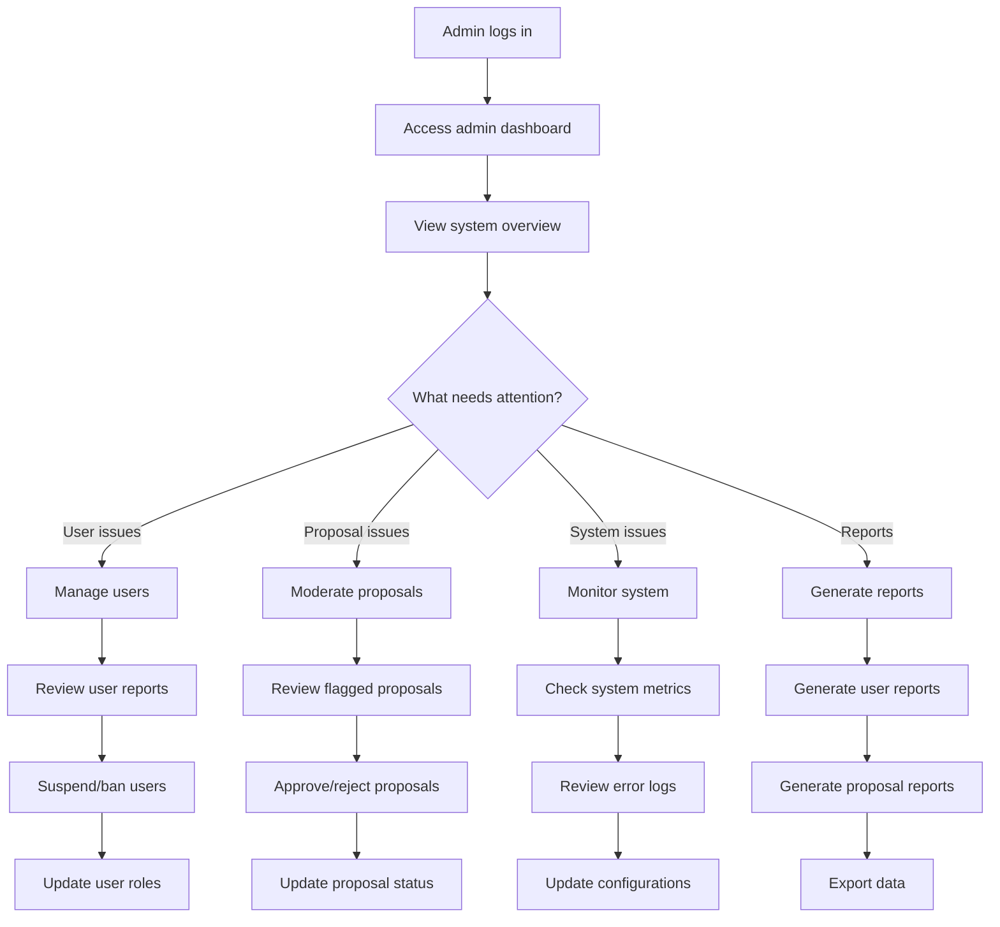
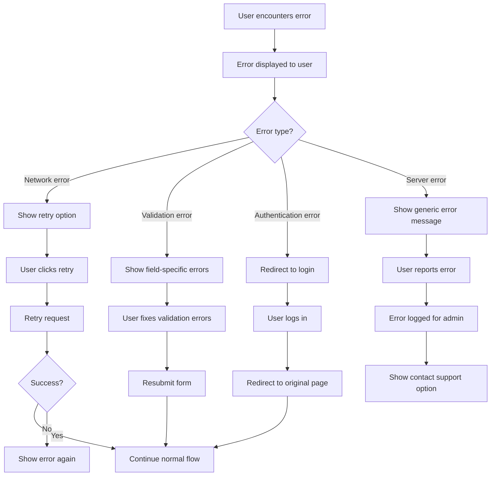
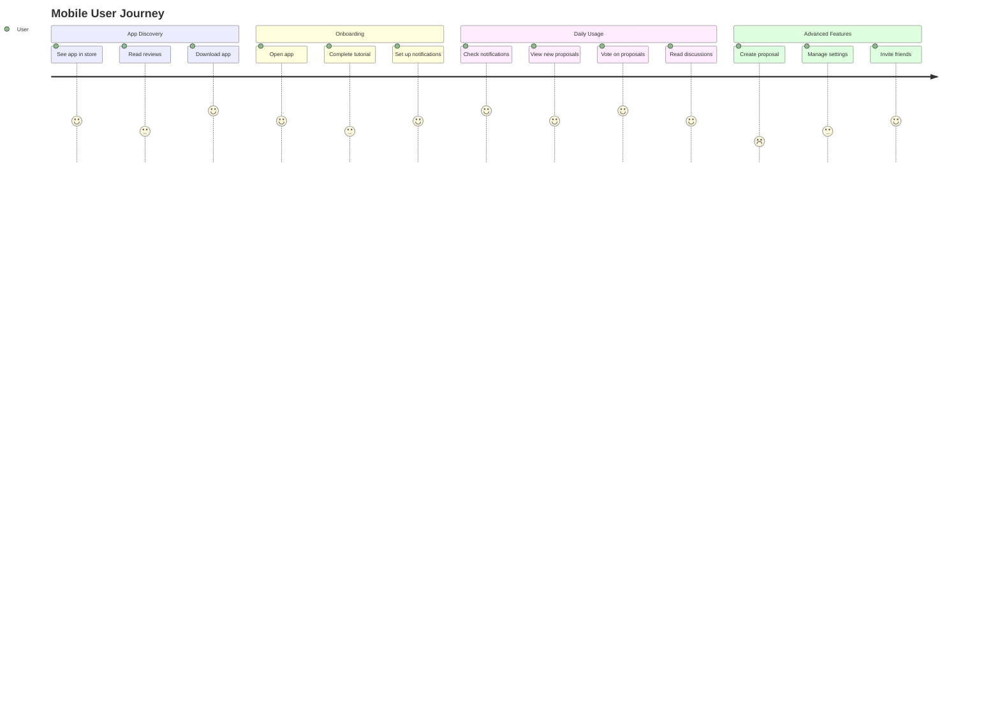
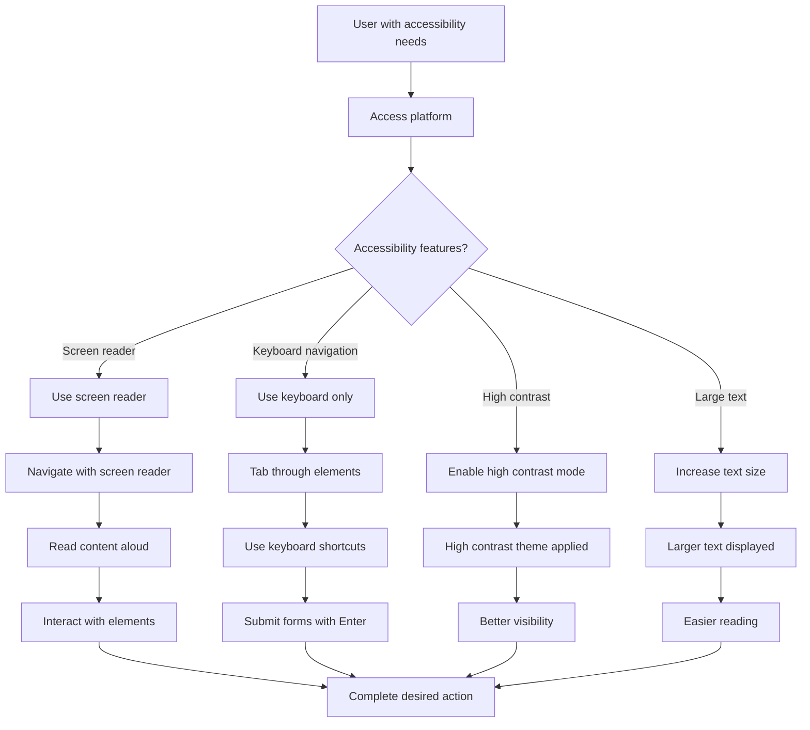

# User Journey Diagram

## User Onboarding Journey

## Proposal Creation Journey

## Voting Journey

## Admin Management Journey

## Error Handling Journey

## Mobile User Journey

## Accessibility Journey

## User Personas

### 1. New User (Sarah)
- **Age**: 28
- **Background**: Software developer
- **Goals**: Learn about DAO governance
- **Pain Points**: Complex interface, unclear voting process
- **Journey**: Discovery → Registration → First vote → Engagement

### 2. Active Member (John)
- **Age**: 35
- **Background**: Community organizer
- **Goals**: Participate in governance, create proposals
- **Pain Points**: Time-consuming proposal creation
- **Journey**: Login → View proposals → Vote → Create proposal → Discussion

### 3. Admin (Maria)
- **Age**: 42
- **Background**: Platform administrator
- **Goals**: Maintain platform health, moderate content
- **Pain Points**: Managing multiple issues simultaneously
- **Journey**: Login → Dashboard → Monitor → Take action → Report

### 4. Mobile User (Alex)
- **Age**: 24
- **Background**: Student
- **Goals**: Quick access to voting, notifications
- **Pain Points**: Limited mobile features
- **Journey**: Open app → Check notifications → Vote → Close app

## User Experience Metrics

### Key Performance Indicators
- **Onboarding Completion Rate**: 85%
- **Time to First Vote**: < 5 minutes
- **User Retention Rate**: 70% (30 days)
- **Proposal Creation Rate**: 15% of active users
- **Mobile Usage**: 60% of total users

### Success Metrics
- **User Satisfaction Score**: 4.5/5
- **Task Completion Rate**: 90%
- **Error Rate**: < 2%
- **Support Ticket Volume**: < 5% of users
- **Feature Adoption Rate**: 80%

## Improvement Opportunities

### 1. Onboarding
- Simplify registration process
- Add interactive tutorial
- Provide clear value proposition
- Reduce time to first action

### 2. Voting Experience
- Improve proposal discovery
- Add voting reminders
- Simplify voting interface
- Provide voting history

### 3. Mobile Experience
- Optimize for mobile devices
- Add push notifications
- Improve touch interactions
- Reduce data usage

### 4. Accessibility
- Improve screen reader support
- Add keyboard navigation
- Provide high contrast mode
- Support multiple languages
