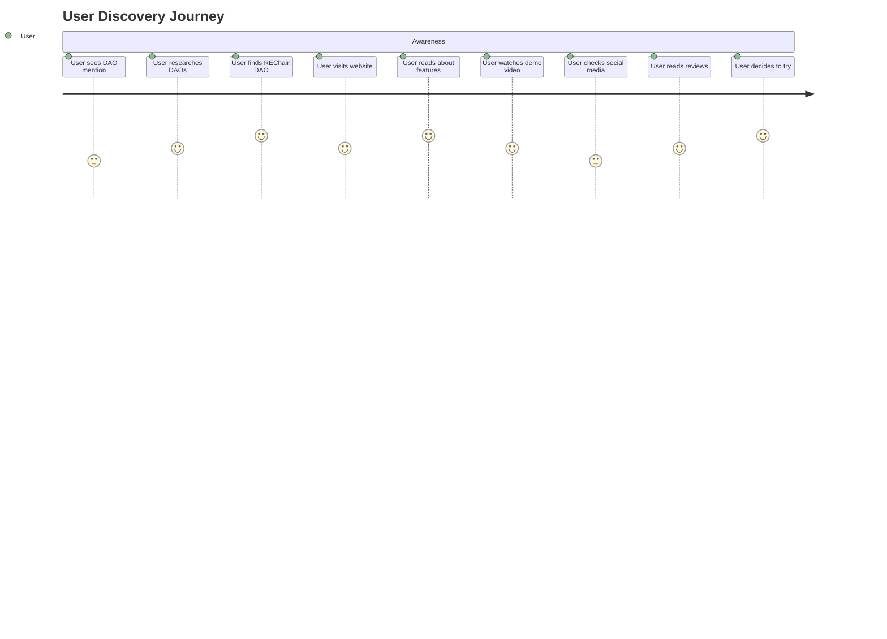
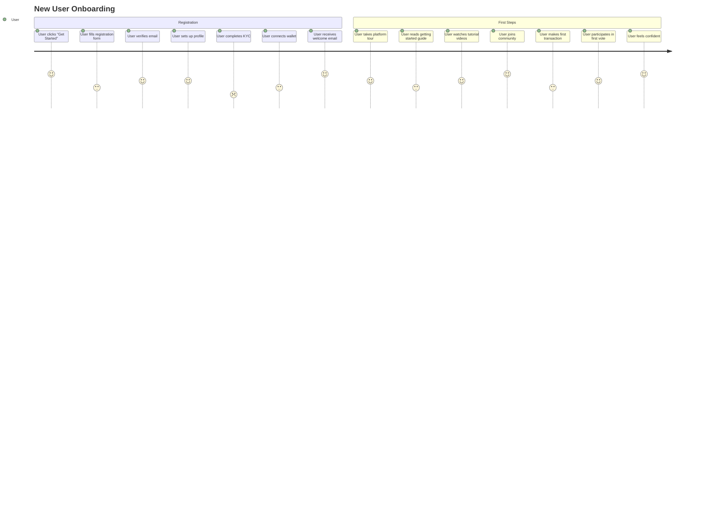
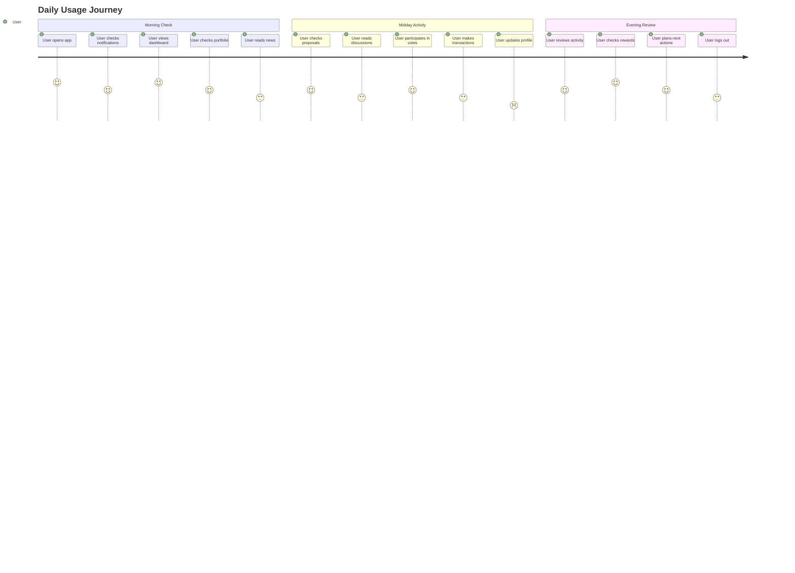
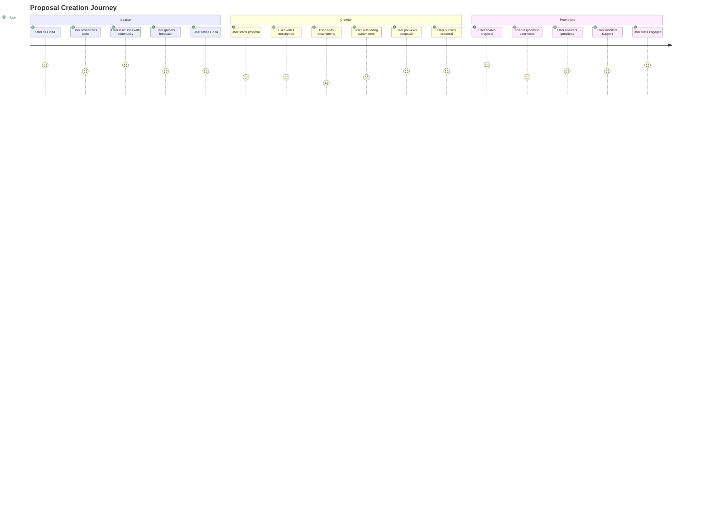
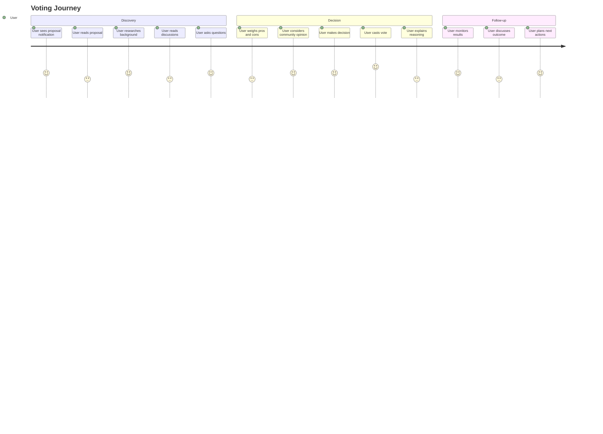
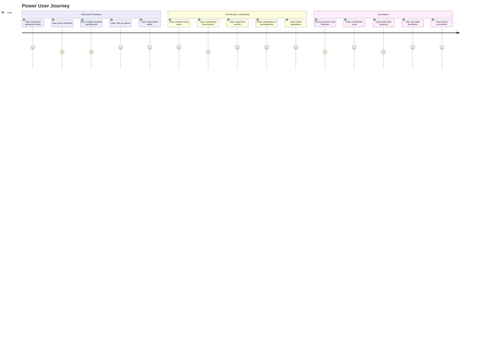
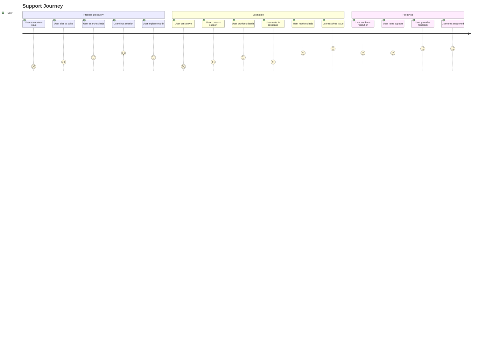

# User Journey Maps

## Overview

This document provides comprehensive user journey maps for the REChain DAO platform, including different user personas, their goals, pain points, and the complete user experience from discovery to advanced usage.

## Table of Contents

1. [User Personas](#user-personas)
2. [Discovery Journey](#discovery-journey)
3. [Onboarding Journey](#onboarding-journey)
4. [Daily Usage Journey](#daily-usage-journey)
5. [Governance Participation Journey](#governance-participation-journey)
6. [Advanced User Journey](#advanced-user-journey)
7. [Support Journey](#support-journey)

## User Personas

### Primary Personas
```yaml
user_personas:
  newbie_user:
    name: "Sarah - Crypto Newbie"
    age: 28
    occupation: "Marketing Manager"
    crypto_experience: "None"
    goals:
      - Learn about DAOs
      - Participate in governance
      - Earn rewards
    pain_points:
      - Complex terminology
      - Fear of losing money
      - Overwhelming interface
    needs:
      - Simple explanations
      - Step-by-step guidance
      - Safety features
  
  experienced_user:
    name: "Mike - DeFi Enthusiast"
    age: 35
    occupation: "Software Developer"
    crypto_experience: "2+ years"
    goals:
      - Maximize returns
      - Advanced governance
      - Technical features
    pain_points:
      - Limited advanced features
      - Slow transaction processing
      - Complex governance rules
    needs:
      - Advanced tools
      - Fast transactions
      - Detailed analytics
  
  institutional_user:
    name: "Jennifer - Fund Manager"
    age: 42
    occupation: "Investment Manager"
    crypto_experience: "5+ years"
    goals:
      - Large-scale participation
      - Risk management
      - Compliance
    pain_points:
      - Regulatory uncertainty
      - Security concerns
      - Scalability issues
    needs:
      - Enterprise features
      - Compliance tools
      - Security guarantees
```

## Discovery Journey

### Awareness Stage


### Discovery Touchpoints
```yaml
discovery_touchpoints:
  social_media:
    platforms: ["Twitter", "LinkedIn", "Reddit", "Discord"]
    content_types: ["Educational posts", "Success stories", "Feature announcements"]
    engagement: "High"
  
  content_marketing:
    blog_posts: ["DAO basics", "Governance guides", "Success stories"]
    videos: ["Platform demos", "Tutorial series", "Webinars"]
    podcasts: ["DAO discussions", "Expert interviews"]
  
  community:
    discord_server: "Active discussions"
    telegram_group: "Quick updates"
    reddit_community: "Detailed discussions"
    github_repository: "Technical discussions"
  
  partnerships:
    crypto_exchanges: "Listing announcements"
    defi_protocols: "Integration news"
    media_outlets: "Press coverage"
    influencers: "Sponsored content"
```

## Onboarding Journey

### New User Onboarding


### Onboarding Steps
```yaml
onboarding_steps:
  step_1_registration:
    title: "Account Creation"
    duration: "2-3 minutes"
    actions:
      - Fill registration form
      - Verify email address
      - Set password
    success_criteria: "Account created successfully"
  
  step_2_profile_setup:
    title: "Profile Setup"
    duration: "3-5 minutes"
    actions:
      - Upload profile picture
      - Add personal information
      - Set preferences
    success_criteria: "Profile completed"
  
  step_3_kyc_verification:
    title: "Identity Verification"
    duration: "5-10 minutes"
    actions:
      - Upload ID document
      - Take selfie
      - Wait for verification
    success_criteria: "KYC approved"
  
  step_4_wallet_connection:
    title: "Wallet Connection"
    duration: "2-3 minutes"
    actions:
      - Connect existing wallet
      - Create new wallet
      - Fund wallet
    success_criteria: "Wallet connected and funded"
  
  step_5_platform_tour:
    title: "Platform Tour"
    duration: "5-7 minutes"
    actions:
      - Take interactive tour
      - Explore features
      - Complete tutorial
    success_criteria: "Tour completed"
  
  step_6_first_actions:
    title: "First Actions"
    duration: "10-15 minutes"
    actions:
      - Make first transaction
      - Participate in first vote
      - Join community
    success_criteria: "First actions completed"
```

## Daily Usage Journey

### Daily User Flow


### Daily Touchpoints
```yaml
daily_touchpoints:
  mobile_app:
    features: ["Push notifications", "Quick actions", "Portfolio view"]
    usage_pattern: "Multiple times per day"
    satisfaction: "High"
  
  web_platform:
    features: ["Full functionality", "Advanced tools", "Detailed analytics"]
    usage_pattern: "Once or twice per day"
    satisfaction: "High"
  
  email_notifications:
    types: ["Proposal updates", "Vote reminders", "Transaction confirmations"]
    frequency: "As needed"
    satisfaction: "Medium"
  
  community_channels:
    platforms: ["Discord", "Telegram", "Reddit"]
    usage_pattern: "Daily"
    satisfaction: "High"
```

## Governance Participation Journey

### Proposal Creation Journey


### Voting Journey


## Advanced User Journey

### Power User Flow


### Advanced Features
```yaml
advanced_features:
  analytics_dashboard:
    description: "Comprehensive analytics and reporting"
    usage: "Daily"
    satisfaction: "High"
    value: "High"
  
  automation_tools:
    description: "Automated voting and transaction management"
    usage: "Weekly"
    satisfaction: "High"
    value: "High"
  
  api_access:
    description: "Programmatic access to platform features"
    usage: "Daily"
    satisfaction: "High"
    value: "Very High"
  
  custom_integrations:
    description: "Integration with external tools and services"
    usage: "Monthly"
    satisfaction: "Medium"
    value: "High"
  
  advanced_governance:
    description: "Complex governance mechanisms and voting strategies"
    usage: "Weekly"
    satisfaction: "High"
    value: "High"
```

## Support Journey

### Problem Resolution Journey


### Support Channels
```yaml
support_channels:
  self_service:
    help_center: "Comprehensive knowledge base"
    faq: "Frequently asked questions"
    video_tutorials: "Step-by-step guides"
    community_forum: "Peer-to-peer support"
  
  live_support:
    chat_support: "Real-time assistance"
    email_support: "Detailed issue resolution"
    phone_support: "Urgent issues"
    video_call: "Complex problems"
  
  community_support:
    discord: "Real-time community help"
    telegram: "Quick questions"
    reddit: "Detailed discussions"
    github: "Technical issues"
```

## User Experience Metrics

### Key Performance Indicators
```yaml
kpis:
  onboarding:
    completion_rate: "85%"
    time_to_completion: "15 minutes"
    drop_off_points: ["KYC verification", "Wallet connection"]
    satisfaction_score: "4.2/5"
  
  daily_usage:
    daily_active_users: "10,000+"
    session_duration: "12 minutes"
    feature_adoption: "70%"
    retention_rate: "80%"
  
  governance:
    proposal_participation: "60%"
    voting_rate: "45%"
    proposal_quality: "4.0/5"
    community_engagement: "High"
  
  support:
    resolution_time: "2 hours"
    satisfaction_score: "4.5/5"
    escalation_rate: "15%"
    self_service_usage: "70%"
```

### User Satisfaction Scores
```yaml
satisfaction_scores:
  overall_experience: "4.3/5"
  ease_of_use: "4.1/5"
  feature_completeness: "4.4/5"
  performance: "4.2/5"
  support_quality: "4.5/5"
  community: "4.6/5"
  security: "4.7/5"
  innovation: "4.0/5"
```

## Pain Points and Solutions

### Common Pain Points
```yaml
pain_points:
  complexity:
    description: "Platform is too complex for new users"
    impact: "High"
    solutions:
      - Simplified onboarding
      - Progressive disclosure
      - Interactive tutorials
      - Contextual help
  
  performance:
    description: "Slow loading times and transaction processing"
    impact: "Medium"
    solutions:
      - Performance optimization
      - Caching improvements
      - CDN implementation
      - Database optimization
  
  mobile_experience:
    description: "Limited mobile functionality"
    impact: "Medium"
    solutions:
      - Mobile app development
      - Responsive design
      - Touch-friendly interface
      - Offline capabilities
  
  documentation:
    description: "Insufficient documentation and guides"
    impact: "Medium"
    solutions:
      - Comprehensive documentation
      - Video tutorials
      - Interactive guides
      - Community contributions
```

### Success Factors
```yaml
success_factors:
  user_education:
    - Clear explanations
    - Step-by-step guides
    - Video tutorials
    - Community support
  
  intuitive_design:
    - Clean interface
    - Logical navigation
    - Consistent patterns
    - Accessibility features
  
  performance:
    - Fast loading
    - Reliable transactions
    - Real-time updates
    - Mobile optimization
  
  community:
    - Active community
    - Helpful members
    - Regular events
    - Knowledge sharing
```

## Conclusion

These user journey maps provide comprehensive insights into the user experience of the REChain DAO platform, from initial discovery to advanced usage. They help identify pain points, optimize user flows, and improve overall satisfaction.

Remember: User journey maps should be regularly updated based on user feedback, analytics data, and platform changes. They are living documents that evolve with the user experience and should be maintained alongside the product development process.
